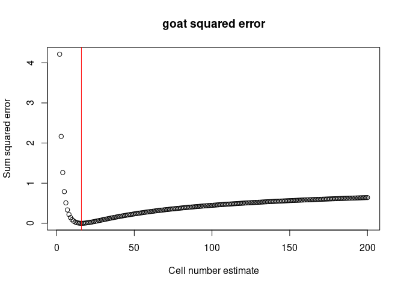
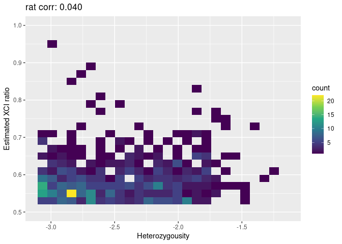
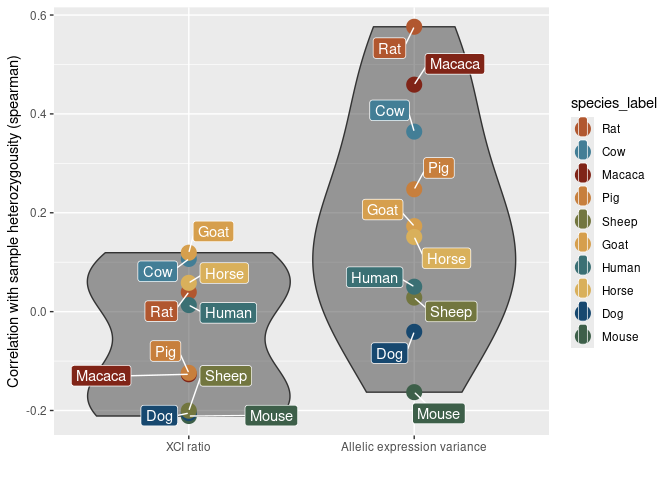
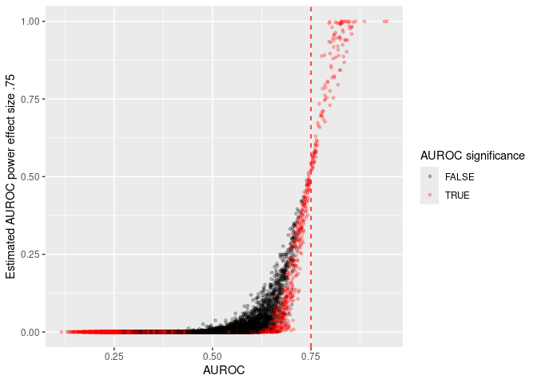
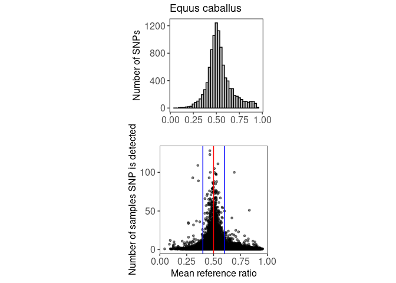
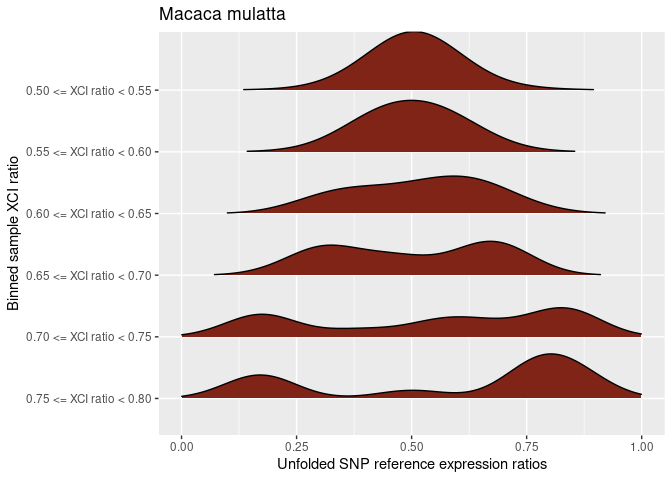
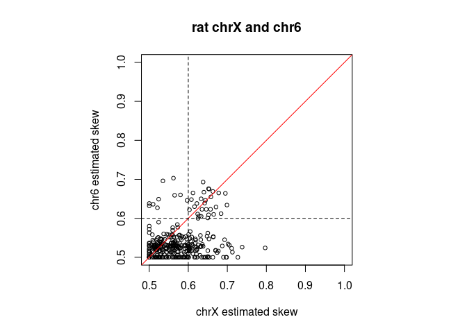
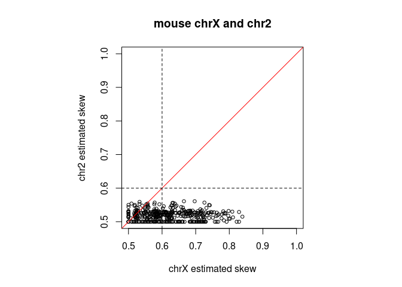
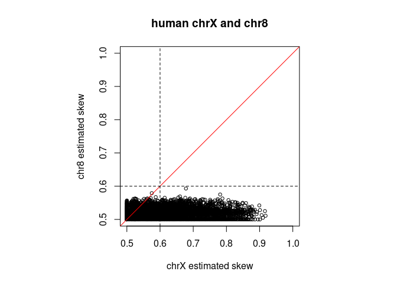
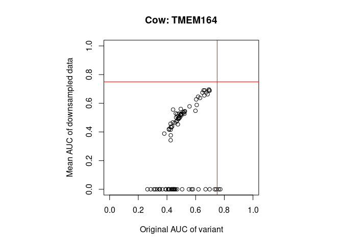

Werner, Hover, and Gillis. Population variability in X-chromosome
inactivation across 10 mammalian species. 2024. Code and data for
figures.
================
Jonathan Werner
2024-09-12

This markdown file contains the code for generating all plots for the
publication: Werner, Hover, and Gillis. Population variability in
X-chromosome inactivation across 10 mammalian species. 2024.

All data for these plots is provided at:
<https://github.com/gillislab/cross_mammal_xci/tree/main/R/data_for_plots>

``` r
library(ggplot2)
library(dplyr)
```

    ## 
    ## Attaching package: 'dplyr'

    ## The following objects are masked from 'package:stats':
    ## 
    ##     filter, lag

    ## The following objects are masked from 'package:base':
    ## 
    ##     intersect, setdiff, setequal, union

``` r
library(ggrepel)
library(ComplexHeatmap)
```

    ## Loading required package: grid

    ## ========================================
    ## ComplexHeatmap version 2.20.0
    ## Bioconductor page: http://bioconductor.org/packages/ComplexHeatmap/
    ## Github page: https://github.com/jokergoo/ComplexHeatmap
    ## Documentation: http://jokergoo.github.io/ComplexHeatmap-reference
    ## 
    ## If you use it in published research, please cite either one:
    ## - Gu, Z. Complex Heatmap Visualization. iMeta 2022.
    ## - Gu, Z. Complex heatmaps reveal patterns and correlations in multidimensional 
    ##     genomic data. Bioinformatics 2016.
    ## 
    ## 
    ## The new InteractiveComplexHeatmap package can directly export static 
    ## complex heatmaps into an interactive Shiny app with zero effort. Have a try!
    ## 
    ## This message can be suppressed by:
    ##   suppressPackageStartupMessages(library(ComplexHeatmap))
    ## ========================================

``` r
library(gridExtra)
```

    ## 
    ## Attaching package: 'gridExtra'

    ## The following object is masked from 'package:dplyr':
    ## 
    ##     combine

``` r
library(ggExtra)
library(ggridges)
```

``` r
library(MetBrewer)
species_colors = met.brewer("Tiepolo", n=10,type="continuous")

#Going by the ranking of estimated cell counts
species_palette = c('Macaca' = species_colors[1], 'Rat' = species_colors[2], 'Pig' = species_colors[3],
                    'Goat' = species_colors[4], 'Horse' = species_colors[5], 'Sheep' = species_colors[6],
                    'Human' = species_colors[8], 'Mouse' = species_colors[7], 'Cow' = species_colors[9], 'Dog' = species_colors[10])

species_palette
```

    ##    Macaca       Rat       Pig      Goat     Horse     Sheep     Human     Mouse 
    ## "#802417" "#B1572F" "#C77F3D" "#D69F4D" "#D9B05B" "#72763F" "#3B7074" "#3D5F49" 
    ##       Cow       Dog 
    ## "#437E96" "#17486F"

## Figure 1C

``` r
#Contains the species_sample_df dataframe
load('/home/werner/projects/cross_species_XCI/final_plots/R/data_for_plots/species_sample_df.Rdata')


filter_label = c(rep('Annotated female', length = 10), rep('>= 10 well-powered SNPs', length = 10))
ggplot(species_sample_df, aes(x = species, y = sample_number, alpha = filter_label, fill = species)) + geom_bar(position="dodge", stat="identity") + coord_flip() +
  ylab('# of bulk RNA-seq samples') +
  scale_fill_manual(values = species_palette, guide = guide_legend(reverse = TRUE)) + scale_alpha_manual(values = c('Annotated female' = 1, '>= 10 well-powered SNPs' = .5)) +
  theme(panel.grid.major = element_blank(), panel.grid.minor = element_blank(), 
      panel.background = element_rect(fill = 'white'), panel.border = element_rect(color = "black", fill=NA),  
      axis.text.y = element_text(size=12), axis.text.x = element_text(size=12),
      axis.title.y = element_text(size=12), axis.title.x = element_text(size=12)) 
```

<!-- -->

## Supp. Figure 1B

``` r
load('/home/werner/projects/cross_species_XCI/final_plots/R/data_for_plots/num_snps_df.Rdata')

ggplot(num_snps_df, aes(x = species, y = snp_counts, fill = species)) + geom_violin(scale = 'width') + scale_fill_manual(values = species_palette) +
  ylab('Number of well-powered SNPs per sample')
```

<!-- -->

## Supp. Figure 6A

``` r
#contains the species_squared_error_df dataframe
load(file = '/home/werner/projects/cross_species_XCI/final_plots/R/data_for_plots/species_squared_error_df')


plot(species_squared_error_df$n_vec, species_squared_error_df$horse_error, main = 'Horse squared error', xlab = 'Cell number estimate', ylab = 'Sum squared error')
abline(v = species_squared_error_df$n_vec[which.min(species_squared_error_df$horse_error)], col = 'red')
```

<!-- -->

``` r
plot(species_squared_error_df$n_vec, species_squared_error_df$dog_error, main = 'dog squared error', xlab = 'Cell number estimate', ylab = 'Sum squared error')
abline(v = species_squared_error_df$n_vec[which.min(species_squared_error_df$dog_error)], col = 'red')
```

<!-- -->

``` r
plot(species_squared_error_df$n_vec, species_squared_error_df$cow_error, main = 'cow squared error', xlab = 'Cell number estimate', ylab = 'Sum squared error')
abline(v = species_squared_error_df$n_vec[which.min(species_squared_error_df$cow_error)], col = 'red')
```

<!-- -->

``` r
plot(species_squared_error_df$n_vec, species_squared_error_df$sheep_error, main = 'sheep squared error', xlab = 'Cell number estimate', ylab = 'Sum squared error')
abline(v = species_squared_error_df$n_vec[which.min(species_squared_error_df$sheep_error)], col = 'red')
```

<!-- -->

``` r
plot(species_squared_error_df$n_vec, species_squared_error_df$goat_error, main = 'goat squared error', xlab = 'Cell number estimate', ylab = 'Sum squared error')
abline(v = species_squared_error_df$n_vec[which.min(species_squared_error_df$goat_error)], col = 'red')
```

<!-- -->

``` r
plot(species_squared_error_df$n_vec, species_squared_error_df$rat_error, main = 'rat squared error', xlab = 'Cell number estimate', ylab = 'Sum squared error')
abline(v = species_squared_error_df$n_vec[which.min(species_squared_error_df$rat_error)], col = 'red')
```

<!-- -->

``` r
plot(species_squared_error_df$n_vec, species_squared_error_df$mouse_error, main = 'mouse squared error', xlab = 'Cell number estimate', ylab = 'Sum squared error')
abline(v = species_squared_error_df$n_vec[which.min(species_squared_error_df$mouse_error)], col = 'red')
```

<!-- -->

``` r
plot(species_squared_error_df$n_vec, species_squared_error_df$macaca_error, main = 'macaca squared error', xlab = 'Cell number estimate', ylab = 'Sum squared error')
abline(v = species_squared_error_df$n_vec[which.min(species_squared_error_df$macaca_error)], col = 'red')
```

<!-- -->

``` r
plot(species_squared_error_df$n_vec, species_squared_error_df$pig_error, main = 'pig squared error', xlab = 'Cell number estimate', ylab = 'Sum squared error')
abline(v = species_squared_error_df$n_vec[which.min(species_squared_error_df$pig_error)], col = 'red')
```

<!-- -->

``` r
plot(species_squared_error_df$n_vec, species_squared_error_df$human_error, main = 'human squared error', xlab = 'Cell number estimate', ylab = 'Sum squared error')
abline(v = species_squared_error_df$n_vec[which.min(species_squared_error_df$human_error)], col = 'red')
```

<!-- -->

## Figure 2A

``` r
#Contains the horse_skew_and_stats_df, dog_skew_and_stats_df, cow_skew_and_stats_df, sheep_skew_and_stats_df, goat_skew_and_stats_df, rat_skew_and_stats_df, 
#mouse_skew_and_stats_df, macaca_skew_and_stats_df, pig_skew_and_stats_df, agg_gtex_skew_and_stats_df dataframes
load(file = '/home/werner/projects/cross_species_XCI/final_plots/R/data_for_plots/all_species_skew_and_stats_df.Rdata')

all_skew_and_stats = list(horse_skew_and_stats_df, dog_skew_and_stats_df, cow_skew_and_stats_df, sheep_skew_and_stats_df, 
                          goat_skew_and_stats_df, rat_skew_and_stats_df, mouse_skew_and_stats_df, macaca_skew_and_stats_df, pig_skew_and_stats_df, agg_gtex_skew_and_stats_df)
 
names(all_skew_and_stats) = c('Horse','Dog','Cow','Sheep','Goat','Rat','Mouse','Macaca','Pig', 'Human')


# Functions to fold and unfold ratios 
folded <- function(x) { apply( cbind(x,1-x), 1, max)} 
unfold <- function(x) { c(x,1-x) } 


p = .5
num_bins = 100
binned_x_axis = seq(0,1,1/num_bins)


for(j in 1:length(all_skew_and_stats)){

  fitted_normal_n = species_squared_error_df$n_vec[which.min(species_squared_error_df[ ,j+1])] #first column is the n size vector, skip that
  sigma = sqrt(p*(1-p)/fitted_normal_n)
  dnorm_x = 0:1000/1000
  
  fitted_normal = dnorm(dnorm_x, mean=p, sd = sigma)
  
  theoretical_norms = list()
  n = c(8, 32)
  for(i in 1:length(n)){ 
    sigma_t = sqrt(p*(1-p)/n[i])
    theoretical_norms[[i]] = sigma_t
  }
  
  species_name = names(all_skew_and_stats)[j]
  species_skew_and_stat_df = all_skew_and_stats[[j]]
  specie_color = species_palette[names(species_palette)== species_name]
  
  #Greying out the .4-.6 skews
  fill_vec = rep(specie_color, length(binned_x_axis))
  fill_vec[binned_x_axis >= 0.4 & binned_x_axis <= 0.6] = 'grey'
  color_vec = rep(specie_color, length(binned_x_axis))
  color_vec[binned_x_axis >= 0.4 & binned_x_axis <= 0.6] = 'grey'
  
  
  if(species_name == 'Human'){
    skews = unfold(agg_gtex_skew_and_stats_df$est_skew[agg_gtex_skew_and_stats_df$num_good_snps >= 10])
    df = data.frame(skews = skews)
  }else{
    skews = unfold(filter(species_skew_and_stat_df, num_good_snps_no_escape >= 10 & autosome_imbalance == F)$est_skew_no_escape)
    df = data.frame(skews = skews)
  }
  
  g = ggplot(df, aes(x = skews)) + geom_histogram(aes(y = ..density..), fill = fill_vec, color = color_vec, binwidth = 1/num_bins) +
    xlim(0,1)+ xlab(sprintf('%s XCI ratios', species_name)) + ggtitle(sprintf('%s population XCI ratio distribution', species_name)) +
    stat_function(fun = dnorm, args = list(mean = .5, sd = theoretical_norms[[1]]), n = num_bins, size = .5, alpha = .5, aes(linetype = 'dashed')) +
    stat_function(fun = dnorm, args = list(mean = .5, sd = theoretical_norms[[2]]), n = num_bins, size = .5, alpha = .5, aes(linetype = 'dotted')) + 
    stat_function(fun = dnorm, args = list(mean = .5, sd = sigma), n = num_bins, size = .75, aes(linetype = 'solid')) +
    scale_linetype_manual(name="Estimated cell number",values=c('dashed','dotted','solid'),
                          labels = c('8 cells','32 cells',sprintf('Estimated %i cells', fitted_normal_n)),
                          breaks=c('dashed','dotted','solid'), 
                          guide = guide_legend(override.aes = list(size = c(.5, .5, 2)))) +
    theme(panel.grid.major = element_blank(), panel.grid.minor = element_blank(), 
          panel.background = element_rect(fill = 'white'), panel.border = element_rect(color = "black", fill=NA, size=1),  
          axis.text.y = element_text(size=12), axis.text.x = element_text(size=12),
          axis.title.y = element_text(size=12), axis.title.x = element_text(size=12), 
          legend.position = c(.8,.75))  
  print(g)
  
}
```

    ## Warning: Using `size` aesthetic for lines was deprecated in ggplot2 3.4.0.
    ## ℹ Please use `linewidth` instead.
    ## This warning is displayed once every 8 hours.
    ## Call `lifecycle::last_lifecycle_warnings()` to see where this warning was
    ## generated.

    ## Warning: The `size` argument of `element_rect()` is deprecated as of ggplot2 3.4.0.
    ## ℹ Please use the `linewidth` argument instead.
    ## This warning is displayed once every 8 hours.
    ## Call `lifecycle::last_lifecycle_warnings()` to see where this warning was
    ## generated.

    ## Warning: A numeric `legend.position` argument in `theme()` was deprecated in ggplot2
    ## 3.5.0.
    ## ℹ Please use the `legend.position.inside` argument of `theme()` instead.
    ## This warning is displayed once every 8 hours.
    ## Call `lifecycle::last_lifecycle_warnings()` to see where this warning was
    ## generated.

    ## Warning: The dot-dot notation (`..density..`) was deprecated in ggplot2 3.4.0.
    ## ℹ Please use `after_stat(density)` instead.
    ## This warning is displayed once every 8 hours.
    ## Call `lifecycle::last_lifecycle_warnings()` to see where this warning was
    ## generated.

    ## Warning: Removed 2 rows containing missing values or values outside the scale range
    ## (`geom_bar()`).

<!-- -->

    ## Warning: Removed 2 rows containing missing values or values outside the scale range
    ## (`geom_bar()`).

<!-- -->

    ## Warning: Removed 2 rows containing missing values or values outside the scale range
    ## (`geom_bar()`).

<!-- -->

    ## Warning: Removed 2 rows containing missing values or values outside the scale range
    ## (`geom_bar()`).

<!-- -->

    ## Warning: Removed 2 rows containing missing values or values outside the scale range
    ## (`geom_bar()`).

<!-- -->

    ## Warning: Removed 2 rows containing missing values or values outside the scale range
    ## (`geom_bar()`).

<!-- -->

    ## Warning: Removed 2 rows containing missing values or values outside the scale range
    ## (`geom_bar()`).

<!-- -->

    ## Warning: Removed 2 rows containing missing values or values outside the scale range
    ## (`geom_bar()`).

<!-- -->

    ## Warning: Removed 2 rows containing missing values or values outside the scale range
    ## (`geom_bar()`).

<!-- -->

    ## Warning: Removed 2 rows containing missing values or values outside the scale range
    ## (`geom_bar()`).

<!-- -->

## Figure 2B

``` r
#Contains the all_ci_df dataframe
load('/home/werner/projects/cross_species_XCI/final_plots/R/data_for_plots/all_ci_df.Rdata')
#Species ordered by evolutionary relationships
all_ci_df$species = factor(all_ci_df$species, levels = c('Dog','Horse','Cow','Goat','Sheep','Pig','Rat','Mouse','Human','Macaca'))
ggplot(all_ci_df, aes(y = species, x = log2(cell_num_est), color = species)) + geom_point(size = 3) + geom_errorbar(aes(xmin = log2(lower_ci), xmax = log2(upper_ci))) +
  scale_color_manual(values = species_palette) + xlim(2, 7) + xlab('Cell divisions (log2 cell # estimate)') + ggtitle('Chromosome X') + ylab('') +
  scale_y_discrete(limits=rev)
```

<!-- -->

## Supp. Figure 6 B and C

``` r
#Contains the cell_num_stats_df dataframe
load( file = '/home/werner/projects/cross_species_XCI/final_plots/R/data_for_plots/cell_num_stats_df.Rdata')

ori_corr = cor(cell_num_stats_df$estimated_cell_num, cell_num_stats_df$sample_number, method = 'spearman')
ggplot(cell_num_stats_df, aes(y = log10(sample_number), x = estimated_cell_num, color = species)) + geom_point(size = 3) +
  scale_color_manual(values = species_palette) + ylab('log10( Total sample number )') + xlab('Cell # estimate') + ggtitle(sprintf('Correlation: %1.3f', ori_corr))
```

<!-- -->

``` r
ori_corr = cor(cell_num_stats_df$estimated_cell_num, cell_num_stats_df$mean_snp, method = 'spearman')
ggplot(cell_num_stats_df, aes(y =  mean_snp, x = estimated_cell_num, color = species)) + geom_point(size = 3) +
  scale_color_manual(values = species_palette)  + ylab('Mean SNP # per sample') + xlab('Cell # estimate') + ggtitle(sprintf('Correlation: %1.3f', ori_corr))
```

<!-- -->

## Supp. Figure 6 D

``` r
#Contains the compare_ci_df dataframe
load( file = '/home/werner/projects/cross_species_XCI/final_plots/R/data_for_plots/compare_ci_df.Rdata')

ggplot(compare_ci_df, aes(y = species, x = log2(cell_num_est), color = color_label, alpha = label)) + geom_point(size = 3) + 
  geom_errorbar(aes(xmin = log2(lower_ci), xmax = log2(upper_ci))) +
  scale_alpha_manual(values = c('Downsampled estimate' = .5, 'Original estimate' = 1)) +
  scale_color_manual(values = species_palette) + xlim(2, 7) + xlab('Cell divisions (log2 cell # estimate)') + ggtitle('Chromosome X') + ylab('') +
  scale_y_discrete(limits=rev)
```

<!-- -->

## Figure 3C and Supp. Figure 7 A and B

``` r
#Contains the cow_het_df, rat_het_df, mouse_het_df, macaca_het_df, pig_het_df, sheep_het_df, goat_het_df, dog_het_df,horse_het_df, human_het_df dataframes
load( '/home/werner/projects/cross_species_XCI/final_plots/R/data_for_plots/all_species_het_dfs.Rdata') 

all_het_dfs = list(cow_het_df, rat_het_df, mouse_het_df, macaca_het_df, pig_het_df, sheep_het_df, goat_het_df, dog_het_df,horse_het_df, human_het_df)
all_species = c('cow','rat','mouse','macaca','pig','sheep','goat','dog','horse', 'human')

for(i in 1:length(all_het_dfs)){

  het_df = all_het_dfs[[i]]
  species_name = all_species[i]
  corr = cor(het_df$het_fraction, het_df$est_skew_no_escape, method = 'spearman', use = 'complete.obs')
  p1 = ggplot(het_df, aes(x = log10(het_fraction), y = est_skew_no_escape)) + geom_bin2d(bins = 25) + scale_fill_continuous(type = "viridis") +
    ylim(.5, 1) + ylab('Estimated XCI ratio') + xlab('Heterozygousity') + ggtitle(sprintf('%s corr: %0.3f', species_name, corr))
  print(p1)
  
  corr = cor(het_df$het_fraction, het_df$est_var_no_escape, method = 'spearman', use = 'complete.obs')
  p2 = ggplot(het_df, aes(x = log10(het_fraction), y = est_var_no_escape)) + geom_bin2d(bins = 25) + scale_fill_continuous(type = "viridis") +
    ylab('Estimated XCI SD') + xlab('Heterozygousity') + ggtitle(sprintf('%s corr: %0.3f',species_name, corr))
  print(p2)

}
```

    ## Warning: Removed 595 rows containing non-finite outside the scale range
    ## (`stat_bin2d()`).

    ## Warning: Removed 21 rows containing missing values or values outside the scale range
    ## (`geom_tile()`).

<!-- -->

    ## Warning: Removed 595 rows containing non-finite outside the scale range
    ## (`stat_bin2d()`).

<!-- -->

    ## Warning: Removed 303 rows containing non-finite outside the scale range
    ## (`stat_bin2d()`).
    ## Removed 21 rows containing missing values or values outside the scale range
    ## (`geom_tile()`).

<!-- -->

    ## Warning: Removed 303 rows containing non-finite outside the scale range
    ## (`stat_bin2d()`).

<!-- -->

    ## Warning: Removed 15 rows containing missing values or values outside the scale range
    ## (`geom_tile()`).

<!-- --><!-- -->

    ## Warning: Removed 232 rows containing non-finite outside the scale range
    ## (`stat_bin2d()`).

    ## Warning: Removed 20 rows containing missing values or values outside the scale range
    ## (`geom_tile()`).

<!-- -->

    ## Warning: Removed 232 rows containing non-finite outside the scale range
    ## (`stat_bin2d()`).

<!-- -->

    ## Warning: Removed 55 rows containing non-finite outside the scale range (`stat_bin2d()`).
    ## Removed 20 rows containing missing values or values outside the scale range
    ## (`geom_tile()`).

<!-- -->

    ## Warning: Removed 55 rows containing non-finite outside the scale range
    ## (`stat_bin2d()`).

<!-- -->

    ## Warning: Removed 59 rows containing non-finite outside the scale range (`stat_bin2d()`).
    ## Removed 20 rows containing missing values or values outside the scale range
    ## (`geom_tile()`).

<!-- -->

    ## Warning: Removed 59 rows containing non-finite outside the scale range
    ## (`stat_bin2d()`).

<!-- -->

    ## Warning: Removed 39 rows containing non-finite outside the scale range
    ## (`stat_bin2d()`).

    ## Warning: Removed 17 rows containing missing values or values outside the scale range
    ## (`geom_tile()`).

<!-- -->

    ## Warning: Removed 39 rows containing non-finite outside the scale range
    ## (`stat_bin2d()`).

<!-- -->

    ## Warning: Removed 7 rows containing non-finite outside the scale range
    ## (`stat_bin2d()`).

    ## Warning: Removed 11 rows containing missing values or values outside the scale range
    ## (`geom_tile()`).

<!-- -->

    ## Warning: Removed 7 rows containing non-finite outside the scale range
    ## (`stat_bin2d()`).

<!-- -->

    ## Warning: Removed 8 rows containing non-finite outside the scale range
    ## (`stat_bin2d()`).

    ## Warning: Removed 19 rows containing missing values or values outside the scale range
    ## (`geom_tile()`).

<!-- -->

    ## Warning: Removed 8 rows containing non-finite outside the scale range
    ## (`stat_bin2d()`).

<!-- -->

    ## Warning: Removed 342 rows containing non-finite outside the scale range
    ## (`stat_bin2d()`).

    ## Warning: Removed 23 rows containing missing values or values outside the scale range
    ## (`geom_tile()`).

<!-- -->

    ## Warning: Removed 342 rows containing non-finite outside the scale range
    ## (`stat_bin2d()`).

<!-- -->

## Figure 3A

``` r
species_het_fracs = c(cow_het_df$het_fraction, rat_het_df$het_fraction, mouse_het_df$het_fraction, macaca_het_df$het_fraction, 
                      pig_het_df$het_fraction, sheep_het_df$het_fraction, goat_het_df$het_fraction, dog_het_df$het_fraction,
                      horse_het_df$het_fraction, human_het_df$het_fraction)

species_labels = c(rep('Cow', length = nrow(cow_het_df)), rep('Rat', length = nrow(rat_het_df)), rep('Mouse', length = nrow(mouse_het_df)), 
                   rep('Macaca', length = nrow(macaca_het_df)), 
                   rep('Pig', length = nrow(pig_het_df)), rep('Sheep', length = nrow(sheep_het_df)), rep('Goat', length = nrow(goat_het_df)), 
                   rep('Dog', length = nrow(dog_het_df)), rep('Horse', length = nrow(horse_het_df)),  rep('Human', length = nrow(human_het_df)))

all_species_het_frac_df = data.frame(het_fracs = species_het_fracs, label = species_labels)

median_order_df = all_species_het_frac_df %>% group_by(label) %>% summarize(median = median(het_fracs, na.rm = T)) %>% arrange(desc(median))
all_species_het_frac_df$label = factor( all_species_het_frac_df$label, levels = c(median_order_df$label))

ggplot(all_species_het_frac_df, aes(x = label, y = log10(het_fracs), fill = label)) + geom_violin(scale = 'width') + geom_boxplot(outlier.shape = NA, width = .5, show.legend = F ) +
  ylab('Sample heterozygousity') + xlab('Species') +
  scale_fill_manual(values = species_palette, breaks = levels(all_species_het_frac_df$label))
```

    ## Warning: Removed 1395 rows containing non-finite outside the scale range
    ## (`stat_ydensity()`).

    ## Warning: Removed 1395 rows containing non-finite outside the scale range
    ## (`stat_boxplot()`).

<!-- -->

## Figure 3B

``` r
load( file = '/home/werner/projects/cross_species_XCI/final_plots/R/data_for_plots/het_corr_df_v2.Rdata')

ggplot(het_corr_df, aes(x = corrs_label, y = corrs)) + geom_violin(scale = 'width', fill = 'grey25', alpha = .5) + geom_point(aes(color = species_label), size = 5) +
  scale_color_manual(values = species_palette, breaks = rev(levels(all_species_het_frac_df$label))) +
  scale_fill_manual(values = species_palette, breaks = rev(levels(all_species_het_frac_df$label))) +
  geom_label_repel(aes(label = species_label, fill = species_label), color = 'white',box.padding = 0.5) +
  guides(fill = guide_legend(override.aes = aes(label = ""))) +
  ylab('Correlation with sample heterozygousity (spearman)') + xlab('')
```

<!-- -->

## Figure 4 B

``` r
#Contains the snp_skew_auc_df dataframe
load('/home/werner/projects/cross_species_XCI/final_plots/R/data_for_plots/snp_skew_auc_df_4_10_24.Rdata')

species_order_df = snp_skew_auc_df %>% filter(null_label == 'data') %>% group_by(species) %>% summarize(median = median(aucs)) %>% arrange(desc(median))
ggplot(filter(snp_skew_auc_df, reference_bias_index == FALSE), aes(x = species, y = aucs, color = null_label, fill = species, alpha = null_label)) + 
  geom_violin(scale = 'width', width = .75) +
  scale_fill_manual(values = species_palette, breaks = levels(snp_skew_auc_df$species)) +
  scale_color_manual(values = c('null' = 'grey', 'data' = 'black')) +
  scale_alpha_manual(values = c('null' = .5, 'data' = 1)) +
  ylim(0, 1) +
  geom_hline(yintercept = .5, color = 'red', linetype = 'dashed')
```

<!-- -->
\## Figure 4C

``` r
#contains the snp_skew_auc_with_meta_df dataframe
load('/home/werner/projects/cross_species_XCI/final_plots/R/data_for_plots/snp_skew_auc_with_meta_4_10_24.Rdata')


ggplot(snp_skew_auc_with_meta_df, aes(y = variant_prevalence, x = skew_auc)) + geom_point(size = 1, alpha = .25) + 
  geom_vline(xintercept = .5, linetype = 'dashed', color = 'red') +
  scale_color_manual(values = species_palette) +
  xlab('Strength of XCI ratio and variant association (AUROC)') + ylab('Variant prevalence')
```

    ## Warning: No shared levels found between `names(values)` of the manual scale and the
    ## data's colour values.

<!-- -->

## Figure 4D

``` r
temp_skew_snp_df = snp_skew_auc_with_meta_df %>% filter(skew_auc >= .75 & skew_auc_significance == TRUE & label != 'Human')
temp_skew_snp_df = temp_skew_snp_df %>% group_by(label, gene) %>% mutate(gene = replace(gene,  expression < max(expression), ""))
#Keep the full annotated gene list to include in the paper text
temp_skew_snp_df
```

    ## # A tibble: 115 × 16
    ## # Groups:   label, gene [52]
    ##    variants    chrom_pos gene           skew_auc skew_auc_pval skew_auc_adj_pval
    ##    <chr>           <dbl> <chr>             <dbl>         <dbl>             <dbl>
    ##  1 10987530AG   10987530 ""                0.798 0.000395            0.00530    
    ##  2 10989167GA   10989167 ""                0.777 0.000972            0.0100     
    ##  3 10989336TC   10989336 ""                0.796 0.000742            0.00831    
    ##  4 10989390CT   10989390 ""                0.784 0.00119             0.0115     
    ##  5 114548228AG 114548228 ""                0.755 0.0000991           0.00195    
    ##  6 116320245AG 116320245 "LOC101108113"    0.767 0.000388            0.00523    
    ##  7 25132733GA   25132733 "LOC114111559"    0.799 0.00000000238       0.000000210
    ##  8 25132752AT   25132752 ""                0.762 0.000000795         0.0000379  
    ##  9 47731599CT   47731599 "LAS1L"           0.832 0.00000142          0.0000620  
    ## 10 5194904CT     5194904 "LOC101117055"    0.833 0.00000272          0.000106   
    ## # ℹ 105 more rows
    ## # ℹ 10 more variables: skew_auc_significance <lgl>,
    ## #   skew_auc_power_significance <dbl>, skew_auc_power_effect_55 <dbl>,
    ## #   skew_auc_power_effect_75 <dbl>, skew_auc_bootstrap_var <dbl>,
    ## #   skew_auc_n_pos <dbl>, skew_auc_n_neg <dbl>, variant_prevalence <dbl>,
    ## #   expression <dbl>, label <chr>

``` r
ggplot(temp_skew_snp_df, aes(x = skew_auc, y = variant_prevalence, color = label)) + geom_point(size = 2,show.legend = F) +
  scale_color_manual(values = species_palette) + facet_wrap(~label,ncol = 3, scales = 'free_y') + geom_label_repel(aes(label = gene), size = 3, force = 3, show.legend = F, max.overlaps = 15) +
  xlab('Strength of XCI ratio and variant association (AUROC)') + ylab('Variant prevalence') 
```

    ## Warning: ggrepel: 11 unlabeled data points (too many overlaps). Consider
    ## increasing max.overlaps

<!-- -->

## Supp. Figure 8 A, B, C, and D

``` r
ggplot(snp_skew_auc_with_meta_df, aes(y = variant_prevalence, x = skew_auc, color = skew_auc_significance)) + geom_point(size = 1, alpha = .25) + 
  geom_vline(xintercept = .75, linetype = 'dashed', color = 'red') +
  scale_color_manual(values = c('TRUE' = 'red', 'FALSE' = 'black'), name = 'AUROC significance') +
  xlab('Strength of XCI ratio and variant association (AUROC)') + ylab('Variant prevalence')
```

<!-- -->

``` r
ggplot(snp_skew_auc_with_meta_df, aes(y = skew_auc_power_significance, x = skew_auc, color = skew_auc_significance)) + geom_point(size = 1, alpha = .25) + 
  scale_color_manual(values = c('TRUE' = 'red', 'FALSE' = 'black'), name = 'AUROC significance') +
  xlab('AUROC') + ylab('Estimated AUROC power') +
  geom_vline(xintercept = .75, linetype = 'dashed', color = 'red')
```

<!-- -->

``` r
ggplot(snp_skew_auc_with_meta_df, aes(y = skew_auc_power_effect_75, x = skew_auc, color = skew_auc_significance)) + geom_point(size = 1, alpha = .25) + 
  scale_color_manual(values = c('TRUE' = 'red', 'FALSE' = 'black'), name = 'AUROC significance') +
  geom_vline(xintercept = .75, linetype = 'dashed', color = 'red') +
  xlab('AUROC') + ylab('Estimated AUROC power effect size .75')
```

<!-- -->

``` r
ggplot(snp_skew_auc_with_meta_df, aes(y = skew_auc_bootstrap_var, x = skew_auc, color = skew_auc_significance)) + geom_point(size = 1, alpha = .25) + 
  scale_color_manual(values = c('TRUE' = 'red', 'FALSE' = 'black'), name = 'AUROC significance') +
  geom_vline(xintercept = .75, linetype = 'dashed', color = 'red') +
  xlab('AUROC') + ylab('Variance of bootstrapped AUROC distribution')
```

<!-- -->
\## Supp. Figure 8E

``` r
#Contains the human_ref_check_df, cow_ref_check_df, pig_ref_check_df, sheep_ref_check_df, goat_ref_check_df, horse_ref_check_df, 
#rat_ref_check_df, mouse_ref_check_df, macaca_ref_check_df, dog_ref_check_df dataframes
load(file = '/home/werner/projects/cross_species_XCI/final_plots/R/data_for_plots/all_ref_check_dfs.Rdata')


ggplot(human_ref_check_df, aes(x = ref_biased_index, y = auc, fill = ref_biased_index)) + geom_violin(scale = 'width') + geom_boxplot(width = .25) + ggtitle('human') +
  xlab('Reference biased SNPs') + ylab('XCI ratio and variant AUROC') 
```

<!-- -->

``` r
ggplot(cow_ref_check_df, aes(x = ref_biased_index, y = auc, fill = ref_biased_index)) + geom_violin(scale = 'width') + geom_boxplot(width = .25) + ggtitle('cow') +
  xlab('Reference biased SNPs') + ylab('XCI ratio and variant AUROC') 
```

<!-- -->

``` r
ggplot(pig_ref_check_df, aes(x = ref_biased_index, y = auc, fill = ref_biased_index)) + geom_violin(scale = 'width') + geom_boxplot(width = .25) + ggtitle('pig') +
  xlab('Reference biased SNPs') + ylab('XCI ratio and variant AUROC') 
```

<!-- -->

``` r
ggplot(sheep_ref_check_df, aes(x = ref_biased_index, y = auc, fill = ref_biased_index)) + geom_violin(scale = 'width') + geom_boxplot(width = .25) + ggtitle('sheep') +
  xlab('Reference biased SNPs') + ylab('XCI ratio and variant AUROC') 
```

<!-- -->

``` r
ggplot(goat_ref_check_df, aes(x = ref_biased_index, y = auc, fill = ref_biased_index)) + geom_violin(scale = 'width') + geom_boxplot(width = .25) + ggtitle('goat') +
  xlab('Reference biased SNPs') + ylab('XCI ratio and variant AUROC') 
```

<!-- -->

``` r
ggplot(horse_ref_check_df, aes(x = ref_biased_index, y = auc, fill = ref_biased_index)) + geom_violin(scale = 'width') + geom_boxplot(width = .25) + ggtitle('horse') +
  xlab('Reference biased SNPs') + ylab('XCI ratio and variant AUROC') 
```

<!-- -->

``` r
ggplot(rat_ref_check_df, aes(x = ref_biased_index, y = auc, fill = ref_biased_index)) + geom_violin(scale = 'width') + geom_boxplot(width = .25) + ggtitle('rat') +
  xlab('Reference biased SNPs') + ylab('XCI ratio and variant AUROC') 
```

<!-- -->

``` r
ggplot(mouse_ref_check_df, aes(x = ref_biased_index, y = auc, fill = ref_biased_index)) + geom_violin(scale = 'width') + geom_boxplot(width = .25) + ggtitle('mouse') +
  xlab('Reference biased SNPs') + ylab('XCI ratio and variant AUROC') 
```

<!-- -->

``` r
ggplot(macaca_ref_check_df, aes(x = ref_biased_index, y = auc, fill = ref_biased_index)) + geom_violin(scale = 'width') + geom_boxplot(width = .25) + ggtitle('macaca') +
  xlab('Reference biased SNPs') + ylab('XCI ratio and variant AUROC') 
```

<!-- -->

``` r
ggplot(dog_ref_check_df, aes(x = ref_biased_index, y = auc, fill = ref_biased_index)) + geom_violin(scale = 'width') + geom_boxplot(width = .25) + ggtitle('dog') +
  xlab('Reference biased SNPs') + ylab('XCI ratio and variant AUROC') 
```

<!-- -->

## Supp. Figure 1

``` r
load('/home/werner/projects/cross_species_XCI/final_plots/R/data_for_plots/horse_snp_stat_df.Rdata')
load('/home/werner/projects/cross_species_XCI/final_plots/R/data_for_plots/dog_snp_stat_df.Rdata')
load('/home/werner/projects/cross_species_XCI/final_plots/R/data_for_plots/goat_snp_stat_df.Rdata')
load('/home/werner/projects/cross_species_XCI/final_plots/R/data_for_plots/macaca_snp_stat_df.Rdata')
load('/home/werner/projects/cross_species_XCI/final_plots/R/data_for_plots/mouse_snp_stat_df.Rdata')
load('/home/werner/projects/cross_species_XCI/final_plots/R/data_for_plots/pig_snp_stat_df.Rdata')
load('/home/werner/projects/cross_species_XCI/final_plots/R/data_for_plots/rat_snp_stat_df.Rdata')
load('/home/werner/projects/cross_species_XCI/final_plots/R/data_for_plots/sheep_snp_stat_df.Rdata')
load('/home/werner/projects/cross_species_XCI/final_plots/R/data_for_plots/cow_snp_stat_df.Rdata')

#Horse
p1 = ggplot(horse_snp_stat_df, aes(x = mean_ref_ratio)) + geom_histogram(binwidth = .025, color = 'black', fill = 'grey') + 
  xlab(' ') + ylab('Number of SNPs') + ggtitle('Equus caballus') +
  theme(panel.grid.major = element_blank(), panel.grid.minor = element_blank(), aspect.ratio = 1, 
      panel.background = element_rect(fill = 'white'), panel.border = element_rect(color = "black", fill=NA),  
      axis.text.y = element_text(size=12), axis.text.x = element_text(size=12),
      axis.title.y = element_text(size=12), axis.title.x = element_text(size=12)) 

p2 = ggplot(horse_snp_stat_df, aes(x = mean_ref_ratio, y = num_samples_present)) + geom_point(alpha = .5, size = 1) + 
  geom_vline(xintercept = c(.4, .6), color = 'blue') + geom_vline(xintercept = .5, color = 'red') +
  xlab('Mean reference ratio') + ylab('Number of samples SNP is detected') +
  theme(panel.grid.major = element_blank(), panel.grid.minor = element_blank(), aspect.ratio = 1, 
    panel.background = element_rect(fill = 'white'), panel.border = element_rect(color = "black", fill=NA),  
    axis.text.y = element_text(size=12), axis.text.x = element_text(size=12),
    axis.title.y = element_text(size=12), axis.title.x = element_text(size=12))

p3 = grid.arrange(p1, p2, ncol = 1)
```

<!-- -->

``` r
#Dog
p1 = ggplot(dog_snp_stat_df, aes(x = mean_ref_ratio)) + geom_histogram(binwidth = .025, color = 'black', fill = 'grey') + 
  xlab(' ') + ylab('Number of SNPs') + ggtitle('Canis lupus familiaris') +
  theme(panel.grid.major = element_blank(), panel.grid.minor = element_blank(), aspect.ratio = 1, 
      panel.background = element_rect(fill = 'white'), panel.border = element_rect(color = "black", fill=NA),  
      axis.text.y = element_text(size=12), axis.text.x = element_text(size=12),
      axis.title.y = element_text(size=12), axis.title.x = element_text(size=12)) 

p2 = ggplot(dog_snp_stat_df, aes(x = mean_ref_ratio, y = num_samples_present)) + geom_point(alpha = .5, size = 1) + 
  geom_vline(xintercept = c(.4, .6), color = 'blue') + geom_vline(xintercept = .5, color = 'red') +
  xlab('Mean reference ratio') + ylab('Number of samples SNP is detected') +
  theme(panel.grid.major = element_blank(), panel.grid.minor = element_blank(), aspect.ratio = 1, 
    panel.background = element_rect(fill = 'white'), panel.border = element_rect(color = "black", fill=NA),  
    axis.text.y = element_text(size=12), axis.text.x = element_text(size=12),
    axis.title.y = element_text(size=12), axis.title.x = element_text(size=12))

p3 = grid.arrange(p1, p2, ncol = 1)
```

<!-- -->

``` r
#Goat
p1 = ggplot(goat_snp_stat_df, aes(x = mean_ref_ratio)) + geom_histogram(binwidth = .025, color = 'black', fill = 'grey') + 
  xlab(' ') + ylab('Number of SNPs') + ggtitle('Capra hircus') +
  theme(panel.grid.major = element_blank(), panel.grid.minor = element_blank(), aspect.ratio = 1, 
      panel.background = element_rect(fill = 'white'), panel.border = element_rect(color = "black", fill=NA),  
      axis.text.y = element_text(size=12), axis.text.x = element_text(size=12),
      axis.title.y = element_text(size=12), axis.title.x = element_text(size=12)) 

p2 = ggplot(goat_snp_stat_df, aes(x = mean_ref_ratio, y = num_samples_present)) + geom_point(alpha = .5, size = 1) + 
  geom_vline(xintercept = c(.4, .6), color = 'blue') + geom_vline(xintercept = .5, color = 'red') +
  xlab('Mean reference ratio') + ylab('Number of samples SNP is detected') +
  theme(panel.grid.major = element_blank(), panel.grid.minor = element_blank(), aspect.ratio = 1, 
    panel.background = element_rect(fill = 'white'), panel.border = element_rect(color = "black", fill=NA),  
    axis.text.y = element_text(size=12), axis.text.x = element_text(size=12),
    axis.title.y = element_text(size=12), axis.title.x = element_text(size=12))

p3 = grid.arrange(p1, p2, ncol = 1)
```

<!-- -->

``` r
#Macaca
p1 = ggplot(macaca_snp_stat_df, aes(x = mean_ref_ratio)) + geom_histogram(binwidth = .025, color = 'black', fill = 'grey') + 
  xlab(' ') + ylab('Number of SNPs') + ggtitle('Macaca mulatta') +
  theme(panel.grid.major = element_blank(), panel.grid.minor = element_blank(), aspect.ratio = 1, 
      panel.background = element_rect(fill = 'white'), panel.border = element_rect(color = "black", fill=NA),  
      axis.text.y = element_text(size=12), axis.text.x = element_text(size=12),
      axis.title.y = element_text(size=12), axis.title.x = element_text(size=12)) 

p2 = ggplot(macaca_snp_stat_df, aes(x = mean_ref_ratio, y = num_samples_present)) + geom_point(alpha = .5, size = 1) + 
  geom_vline(xintercept = c(.4, .6), color = 'blue') + geom_vline(xintercept = .5, color = 'red') +
  xlab('Mean reference ratio') + ylab('Number of samples SNP is detected') +
  theme(panel.grid.major = element_blank(), panel.grid.minor = element_blank(), aspect.ratio = 1, 
    panel.background = element_rect(fill = 'white'), panel.border = element_rect(color = "black", fill=NA),  
    axis.text.y = element_text(size=12), axis.text.x = element_text(size=12),
    axis.title.y = element_text(size=12), axis.title.x = element_text(size=12))

p3 = grid.arrange(p1, p2, ncol = 1)
```

<!-- -->

``` r
#mouse
p1 = ggplot(mouse_snp_stat_df, aes(x = mean_ref_ratio)) + geom_histogram(binwidth = .025, color = 'black', fill = 'grey') + 
  xlab(' ') + ylab('Number of SNPs') + ggtitle('Mus musculus') +
  theme(panel.grid.major = element_blank(), panel.grid.minor = element_blank(), aspect.ratio = 1, 
      panel.background = element_rect(fill = 'white'), panel.border = element_rect(color = "black", fill=NA),  
      axis.text.y = element_text(size=12), axis.text.x = element_text(size=12),
      axis.title.y = element_text(size=12), axis.title.x = element_text(size=12)) 

p2 = ggplot(mouse_snp_stat_df, aes(x = mean_ref_ratio, y = num_samples_present)) + geom_point(alpha = .5, size = 1) + 
  geom_vline(xintercept = c(.4, .6), color = 'blue') + geom_vline(xintercept = .5, color = 'red') +
  xlab('Mean reference ratio') + ylab('Number of samples SNP is detected') +
  theme(panel.grid.major = element_blank(), panel.grid.minor = element_blank(), aspect.ratio = 1, 
    panel.background = element_rect(fill = 'white'), panel.border = element_rect(color = "black", fill=NA),  
    axis.text.y = element_text(size=12), axis.text.x = element_text(size=12),
    axis.title.y = element_text(size=12), axis.title.x = element_text(size=12))

p3 = grid.arrange(p1, p2, ncol = 1)
```

<!-- -->

``` r
#Pig
p1 = ggplot(pig_snp_stat_df, aes(x = mean_ref_ratio)) + geom_histogram(binwidth = .025, color = 'black', fill = 'grey') + 
  xlab(' ') + ylab('Number of SNPs') + ggtitle('Sus scrofa') +
  theme(panel.grid.major = element_blank(), panel.grid.minor = element_blank(), aspect.ratio = 1, 
      panel.background = element_rect(fill = 'white'), panel.border = element_rect(color = "black", fill=NA),  
      axis.text.y = element_text(size=12), axis.text.x = element_text(size=12),
      axis.title.y = element_text(size=12), axis.title.x = element_text(size=12)) 

p2 = ggplot(pig_snp_stat_df, aes(x = mean_ref_ratio, y = num_samples_present)) + geom_point(alpha = .5, size = 1) + 
  geom_vline(xintercept = c(.4, .6), color = 'blue') + geom_vline(xintercept = .5, color = 'red') +
  xlab('Mean reference ratio') + ylab('Number of samples SNP is detected') +
  theme(panel.grid.major = element_blank(), panel.grid.minor = element_blank(), aspect.ratio = 1, 
    panel.background = element_rect(fill = 'white'), panel.border = element_rect(color = "black", fill=NA),  
    axis.text.y = element_text(size=12), axis.text.x = element_text(size=12),
    axis.title.y = element_text(size=12), axis.title.x = element_text(size=12))

p3 = grid.arrange(p1, p2, ncol = 1)
```

<!-- -->

``` r
#Rat
p1 = ggplot(rat_snp_stat_df, aes(x = mean_ref_ratio)) + geom_histogram(binwidth = .025, color = 'black', fill = 'grey') + 
  xlab(' ') + ylab('Number of SNPs') + ggtitle('Rattus norvegicus') +
  theme(panel.grid.major = element_blank(), panel.grid.minor = element_blank(), aspect.ratio = 1, 
      panel.background = element_rect(fill = 'white'), panel.border = element_rect(color = "black", fill=NA),  
      axis.text.y = element_text(size=12), axis.text.x = element_text(size=12),
      axis.title.y = element_text(size=12), axis.title.x = element_text(size=12)) 

p2 = ggplot(rat_snp_stat_df, aes(x = mean_ref_ratio, y = num_samples_present)) + geom_point(alpha = .5, size = 1) + 
  geom_vline(xintercept = c(.4, .6), color = 'blue') + geom_vline(xintercept = .5, color = 'red') +
  xlab('Mean reference ratio') + ylab('Number of samples SNP is detected') +
  theme(panel.grid.major = element_blank(), panel.grid.minor = element_blank(), aspect.ratio = 1, 
    panel.background = element_rect(fill = 'white'), panel.border = element_rect(color = "black", fill=NA),  
    axis.text.y = element_text(size=12), axis.text.x = element_text(size=12),
    axis.title.y = element_text(size=12), axis.title.x = element_text(size=12))

p3 = grid.arrange(p1, p2, ncol = 1)
```

<!-- -->

``` r
#Sheep
p1 = ggplot(sheep_snp_stat_df, aes(x = mean_ref_ratio)) + geom_histogram(binwidth = .025, color = 'black', fill = 'grey') + 
  xlab(' ') + ylab('Number of SNPs') + ggtitle('Ovis aries') +
  theme(panel.grid.major = element_blank(), panel.grid.minor = element_blank(), aspect.ratio = 1, 
      panel.background = element_rect(fill = 'white'), panel.border = element_rect(color = "black", fill=NA),  
      axis.text.y = element_text(size=12), axis.text.x = element_text(size=12),
      axis.title.y = element_text(size=12), axis.title.x = element_text(size=12)) 

p2 = ggplot(sheep_snp_stat_df, aes(x = mean_ref_ratio, y = num_samples_present)) + geom_point(alpha = .5, size = 1) + 
  geom_vline(xintercept = c(.4, .6), color = 'blue') + geom_vline(xintercept = .5, color = 'red') +
  xlab('Mean reference ratio') + ylab('Number of samples SNP is detected') +
  theme(panel.grid.major = element_blank(), panel.grid.minor = element_blank(), aspect.ratio = 1, 
    panel.background = element_rect(fill = 'white'), panel.border = element_rect(color = "black", fill=NA),  
    axis.text.y = element_text(size=12), axis.text.x = element_text(size=12),
    axis.title.y = element_text(size=12), axis.title.x = element_text(size=12))

p3 = grid.arrange(p1, p2, ncol = 1)
```

<!-- -->

``` r
#Cow
p1 = ggplot(cow_snp_stat_df, aes(x = mean_ref_ratio)) + geom_histogram(binwidth = .025, color = 'black', fill = 'grey') + 
  xlab(' ') + ylab('Number of SNPs') + ggtitle('Bos taurus') +
  theme(panel.grid.major = element_blank(), panel.grid.minor = element_blank(), aspect.ratio = 1, 
      panel.background = element_rect(fill = 'white'), panel.border = element_rect(color = "black", fill=NA),  
      axis.text.y = element_text(size=12), axis.text.x = element_text(size=12),
      axis.title.y = element_text(size=12), axis.title.x = element_text(size=12)) 

p2 = ggplot(cow_snp_stat_df, aes(x = mean_ref_ratio, y = num_samples_present)) + geom_point(alpha = .5, size = 1) + 
  geom_vline(xintercept = c(.4, .6), color = 'blue') + geom_vline(xintercept = .5, color = 'red') +
  xlab('Mean reference ratio') + ylab('Number of samples SNP is detected') +
  theme(panel.grid.major = element_blank(), panel.grid.minor = element_blank(), aspect.ratio = 1, 
    panel.background = element_rect(fill = 'white'), panel.border = element_rect(color = "black", fill=NA),  
    axis.text.y = element_text(size=12), axis.text.x = element_text(size=12),
    axis.title.y = element_text(size=12), axis.title.x = element_text(size=12))

p3 = grid.arrange(p1, p2, ncol = 1)
```

<!-- -->

## Supp. Figure 2

``` r
load('/home/werner/projects/cross_species_XCI/final_plots/R/data_for_plots/horse_binned_chrom_df.Rdata')
load('/home/werner/projects/cross_species_XCI/final_plots/R/data_for_plots/dog_binned_chrom_df.Rdata')
load('/home/werner/projects/cross_species_XCI/final_plots/R/data_for_plots/goat_binned_chrom_df.Rdata')
load('/home/werner/projects/cross_species_XCI/final_plots/R/data_for_plots/macaca_binned_chrom_df.Rdata')
load('/home/werner/projects/cross_species_XCI/final_plots/R/data_for_plots/mouse_binned_chrom_df.Rdata')
load('/home/werner/projects/cross_species_XCI/final_plots/R/data_for_plots/pig_binned_chrom_df.Rdata')
load('/home/werner/projects/cross_species_XCI/final_plots/R/data_for_plots/rat_binned_chrom_df.Rdata')
load('/home/werner/projects/cross_species_XCI/final_plots/R/data_for_plots/sheep_binned_chrom_df.Rdata')
load('/home/werner/projects/cross_species_XCI/final_plots/R/data_for_plots/cow_binned_chrom_df.Rdata')

#Horse
p1 = ggplot(horse_binned_chrom_df, aes(x = bin, y = mean_bin_ref_ratio, size = num_snps, color = keep_label)) + geom_point(alpha = .5) + geom_hline(yintercept = .65, color = 'red') +
  ylab('Mean folded SNP ratio per bin') + xlab('X chromosome position (1MB bins)') + ggtitle('horse All SNPs')+ ylim(.5, 1) +
  scale_color_manual(values = c('Kept 1MB bin' = 'black', 'Excluded 1MB bin' = 'red'))  
p1 = ggMarginal(p1, margins = 'y', type = 'histogram', yparams = list(binwidth = .005))
```

    ## Warning: Removed 39 rows containing missing values or values outside the scale range
    ## (`geom_point()`).
    ## Removed 39 rows containing missing values or values outside the scale range
    ## (`geom_point()`).

``` r
print(p1)
```

<!-- -->

``` r
#Dog
p2 = ggplot(dog_binned_chrom_df, aes(x = bin, y = mean_bin_ref_ratio, size = num_snps, color = keep_label)) + geom_point(alpha = .5) + geom_hline(yintercept = .675, color = 'red') +
  ylab('Mean folded SNP ratio per bin') + xlab('X chromosome position (1MB bins)') + ggtitle('dog All SNPs')+ ylim(.5, 1) +
  scale_color_manual(values = c('Kept 1MB bin' = 'black', 'Excluded 1MB bin' = 'red'))  
p2 = ggMarginal(p2, margins = 'y', type = 'histogram', yparams = list(binwidth = .005))
```

    ## Warning: Removed 28 rows containing missing values or values outside the scale range
    ## (`geom_point()`).
    ## Removed 28 rows containing missing values or values outside the scale range
    ## (`geom_point()`).

``` r
print(p2)
```

<!-- -->

``` r
#Goat
p3 = ggplot(goat_binned_chrom_df, aes(x = bin, y = mean_bin_ref_ratio, size = num_snps, color = keep_label)) + geom_point(alpha = .5) + geom_hline(yintercept = .65, color = 'red') +
  ylab('Mean folded SNP ratio per bin') + xlab('X chromosome position (1MB bins)') + ggtitle('goat All SNPs')+ ylim(.5, 1) +
  scale_color_manual(values = c('Kept 1MB bin' = 'black', 'Excluded 1MB bin' = 'red'))  
p3 = ggMarginal(p3, margins = 'y', type = 'histogram', yparams = list(binwidth = .005))
```

    ## Warning: Removed 5 rows containing missing values or values outside the scale range
    ## (`geom_point()`).
    ## Removed 5 rows containing missing values or values outside the scale range
    ## (`geom_point()`).

``` r
print(p3)
```

<!-- -->

``` r
#Macaca
p4 = ggplot(macaca_binned_chrom_df, aes(x = bin, y = mean_bin_ref_ratio, size = num_snps, color = keep_label)) + geom_point(alpha = .5) + geom_hline(yintercept = .6, color = 'red') +
  ylab('Mean folded SNP ratio per bin') + xlab('X chromosome position (1MB bins)') + ggtitle('macaca All SNPs')+ ylim(.5, 1) +
  scale_color_manual(values = c('Kept 1MB bin' = 'black', 'Excluded 1MB bin' = 'red'))  
p4 = ggMarginal(p4, margins = 'y', type = 'histogram', yparams = list(binwidth = .005))
```

    ## Warning: Removed 49 rows containing missing values or values outside the scale range
    ## (`geom_point()`).
    ## Removed 49 rows containing missing values or values outside the scale range
    ## (`geom_point()`).

``` r
print(p4)
```

<!-- -->

``` r
#Mouse
p5 = ggplot(mouse_binned_chrom_df, aes(x = bin, y = mean_bin_ref_ratio, size = num_snps, color = keep_label)) + geom_point(alpha = .5) + geom_hline(yintercept = .65, color = 'red') +
  ylab('Mean folded SNP ratio per bin') + xlab('X chromosome position (1MB bins)') + ggtitle('mouse All SNPs')+ ylim(.5, 1) +
  scale_color_manual(values = c('Kept 1MB bin' = 'black', 'Excluded 1MB bin' = 'red'))  
p5 = ggMarginal(p5, margins = 'y', type = 'histogram', yparams = list(binwidth = .005))
```

    ## Warning: Removed 53 rows containing missing values or values outside the scale range
    ## (`geom_point()`).
    ## Removed 53 rows containing missing values or values outside the scale range
    ## (`geom_point()`).

``` r
print(p5)
```

<!-- -->

``` r
#Pig
p6 = ggplot(pig_binned_chrom_df, aes(x = bin, y = mean_bin_ref_ratio, size = num_snps, color = keep_label)) + geom_point(alpha = .5) + geom_hline(yintercept = .65, color = 'red') +
  ylab('Mean folded SNP ratio per bin') + xlab('X chromosome position (1MB bins)') + ggtitle('pig All SNPs')+ ylim(.5, 1) +
  scale_color_manual(values = c('Kept 1MB bin' = 'black', 'Excluded 1MB bin' = 'red'))  
p6 = ggMarginal(p6, margins = 'y', type = 'histogram', yparams = list(binwidth = .005))
```

    ## Warning: Removed 38 rows containing missing values or values outside the scale range
    ## (`geom_point()`).
    ## Removed 38 rows containing missing values or values outside the scale range
    ## (`geom_point()`).

``` r
print(p6)
```

<!-- -->

``` r
#Rat
p7 = ggplot(rat_binned_chrom_df, aes(x = bin, y = mean_bin_ref_ratio, size = num_snps, color = keep_label)) + geom_point(alpha = .5) + geom_hline(yintercept = .6, color = 'red') +
  ylab('Mean folded SNP ratio per bin') + xlab('X chromosome position (1MB bins)') + ggtitle('rat All SNPs')+ ylim(.5, 1) +
  scale_color_manual(values = c('Kept 1MB bin' = 'black', 'Excluded 1MB bin' = 'red'))  
p7 = ggMarginal(p7, margins = 'y', type = 'histogram', yparams = list(binwidth = .005))
```

    ## Warning: Removed 25 rows containing missing values or values outside the scale range
    ## (`geom_point()`).
    ## Removed 25 rows containing missing values or values outside the scale range
    ## (`geom_point()`).

``` r
print(p7)
```

<!-- -->

``` r
#Sheep
p8 = ggplot(sheep_binned_chrom_df, aes(x = bin, y = mean_bin_ref_ratio, size = num_snps, color = keep_label)) + geom_point(alpha = .5) + geom_hline(yintercept = .65, color = 'red') +
  ylab('Mean folded SNP ratio per bin') + xlab('X chromosome position (1MB bins)') + ggtitle('sheep All SNPs')+ ylim(.5, 1) +
  scale_color_manual(values = c('Kept 1MB bin' = 'black', 'Excluded 1MB bin' = 'red'))  
p8 = ggMarginal(p8, margins = 'y', type = 'histogram', yparams = list(binwidth = .005))
```

    ## Warning: Removed 22 rows containing missing values or values outside the scale range
    ## (`geom_point()`).
    ## Removed 22 rows containing missing values or values outside the scale range
    ## (`geom_point()`).

``` r
print(p8)
```

<!-- -->

``` r
#Sheep
p9 = ggplot(cow_binned_chrom_df, aes(x = bin, y = mean_bin_ref_ratio, size = num_snps, color = keep_label)) + geom_point(alpha = .5) + geom_hline(yintercept = .65, color = 'red') +
  ylab('Mean folded SNP ratio per bin') + xlab('X chromosome position (1MB bins)') + ggtitle('cow All SNPs')+ ylim(.5, 1) +
  scale_color_manual(values = c('Kept 1MB bin' = 'black', 'Excluded 1MB bin' = 'red'))  
p9 = ggMarginal(p9, margins = 'y', type = 'histogram', yparams = list(binwidth = .005))
```

    ## Warning: Removed 31 rows containing missing values or values outside the scale range
    ## (`geom_point()`).
    ## Removed 31 rows containing missing values or values outside the scale range
    ## (`geom_point()`).

``` r
print(p9)
```

<!-- -->

## Supp. Figure 4

``` r
load('/home/werner/projects/cross_species_XCI/final_plots/R/data_for_plots/horse_skew_bin_snp_df.Rdata')
load('/home/werner/projects/cross_species_XCI/final_plots/R/data_for_plots/dog_skew_bin_snp_df.Rdata')
load('/home/werner/projects/cross_species_XCI/final_plots/R/data_for_plots/goat_skew_bin_snp_df.Rdata')
load('/home/werner/projects/cross_species_XCI/final_plots/R/data_for_plots/macaca_skew_bin_snp_df.Rdata')
load('/home/werner/projects/cross_species_XCI/final_plots/R/data_for_plots/mouse_skew_bin_snp_df.Rdata')
load('/home/werner/projects/cross_species_XCI/final_plots/R/data_for_plots/pig_skew_bin_snp_df.Rdata')
load('/home/werner/projects/cross_species_XCI/final_plots/R/data_for_plots/rat_skew_bin_snp_df.Rdata')
load('/home/werner/projects/cross_species_XCI/final_plots/R/data_for_plots/sheep_skew_bin_snp_df.Rdata')
load('/home/werner/projects/cross_species_XCI/final_plots/R/data_for_plots/cow_skew_bin_snp_df.Rdata')
#Horse
ggplot(horse_skew_bin_snp_df, aes(x = ref_ratios, y = bin_label)) + geom_density_ridges(rel_min_height = 0.01, scale = 0.95, fill = species_colors[5] ) + xlim(0,1) +
  scale_y_discrete(limits=rev) + ylab('Binned sample XCI ratio') + xlab('Unfolded SNP reference expression ratios') + ggtitle('Equus Caballus')
```

    ## Picking joint bandwidth of 0.0497

<!-- -->

``` r
#Dog
ggplot(dog_skew_bin_snp_df, aes(x = ref_ratios, y = bin_label)) + geom_density_ridges(rel_min_height = 0.01, scale = 0.95, fill = species_colors[10] ) + xlim(0,1) +
  scale_y_discrete(limits=rev) + ylab('Binned sample XCI ratio') + xlab('Unfolded SNP reference expression ratios') + ggtitle('Canis lupus familiaris')
```

    ## Picking joint bandwidth of 0.061

<!-- -->

``` r
#Goat
ggplot(goat_skew_bin_snp_df, aes(x = ref_ratios, y = bin_label)) + geom_density_ridges(rel_min_height = 0.01, scale = 0.95, fill = species_colors[4] ) + xlim(0,1) +
  scale_y_discrete(limits=rev) + ylab('Binned sample XCI ratio') + xlab('Unfolded SNP reference expression ratios') + ggtitle('Capra hircus')
```

    ## Picking joint bandwidth of 0.0504

<!-- -->

``` r
#Macaca
ggplot(macaca_skew_bin_snp_df, aes(x = ref_ratios, y = bin_label)) + geom_density_ridges(rel_min_height = 0.01, scale = 0.95, fill = species_colors[1] ) + xlim(0,1) +
  scale_y_discrete(limits=rev) + ylab('Binned sample XCI ratio') + xlab('Unfolded SNP reference expression ratios') + ggtitle('Macaca mulatta')
```

    ## Picking joint bandwidth of 0.0734

<!-- -->

``` r
#Mouse
ggplot(mouse_skew_bin_snp_df, aes(x = ref_ratios, y = bin_label)) + geom_density_ridges(rel_min_height = 0.01, scale = 0.95, fill = species_colors[7] ) + xlim(0,1) +
  scale_y_discrete(limits=rev) + ylab('Binned sample XCI ratio') + xlab('Unfolded SNP reference expression ratios') + ggtitle('Mus musculus')
```

    ## Picking joint bandwidth of 0.038

<!-- -->

``` r
#Pig
ggplot(pig_skew_bin_snp_df, aes(x = ref_ratios, y = bin_label)) + geom_density_ridges(rel_min_height = 0.01, scale = 0.95, fill = species_colors[3] ) + xlim(0,1) +
  scale_y_discrete(limits=rev) + ylab('Binned sample XCI ratio') + xlab('Unfolded SNP reference expression ratios') + ggtitle('Sus scrofa')
```

    ## Picking joint bandwidth of 0.0712

<!-- -->

``` r
#Rat
ggplot(rat_skew_bin_snp_df, aes(x = ref_ratios, y = bin_label)) + geom_density_ridges(rel_min_height = 0.01, scale = 0.95, fill = species_colors[2] ) + xlim(0,1) +
  scale_y_discrete(limits=rev) + ylab('Binned sample XCI ratio') + xlab('Unfolded SNP reference expression ratios') + ggtitle('rattus norvegicus')
```

    ## Picking joint bandwidth of 0.0561

<!-- -->

``` r
#Sheep
ggplot(sheep_skew_bin_snp_df, aes(x = ref_ratios, y = bin_label)) + geom_density_ridges(rel_min_height = 0.01, scale = 0.95, fill = species_colors[6] ) + xlim(0,1) +
  scale_y_discrete(limits=rev) + ylab('Binned sample XCI ratio') + xlab('Unfolded SNP reference expression ratios') + ggtitle('Ovis aries')
```

    ## Picking joint bandwidth of 0.0488

<!-- -->

``` r
#Cow
ggplot(cow_skew_bin_snp_df, aes(x = ref_ratios, y = bin_label)) + geom_density_ridges(rel_min_height = 0.01, scale = 0.95, fill = species_colors[9] ) + xlim(0,1) +
  scale_y_discrete(limits=rev) + ylab('Binned sample XCI ratio') + xlab('Unfolded SNP reference expression ratios') + ggtitle('Bos taurus')
```

    ## Picking joint bandwidth of 0.0399

<!-- -->

## Supp. Figure 5A

``` r
#Contains the goat_chr19_skew_and_stats_df, goat_chr18_skew_and_stats_df, goat_skew_and_stats_df,
#cow_chr1_skew_and_stats_df, cow_chr2_skew_and_stats_df, cow_skew_and_stats_df,
#horse_chr1_skew_and_stats_df, horse_chr2_skew_and_stats_df, horse_skew_and_stats_df,
#pig_chr4_skew_and_stats_df, pig_chr7_skew_and_stats_df, pig_skew_and_stats_df,
#sheep_chr3_skew_and_stats_df, sheep_chr4_skew_and_stats_df, sheep_skew_and_stats_df,
#rat_chr5_skew_and_stats_df, rat_chr6_skew_and_stats_df, rat_skew_and_stats_df,
#mouse_chr2_skew_and_stats_df, mouse_chr3_skew_and_stats_df, mouse_skew_and_stats_df,
#macaca_chr7_skew_and_stats_df, macaca_chr8_skew_and_stats_df, macaca_skew_and_stats_df,
#dog_chr1_skew_and_stats_df, dog_chr3_skew_and_stats_df, dog_skew_and_stats_df,
#human_chr7_skew_and_stats_df, human_chr8_skew_and_stats_df, human_skew_and_stats_df dataframes

load(file = '/home/werner/projects/cross_species_XCI/final_plots/R/data_for_plots/all_x_and_auto_skew_and_stats_df.Rdata')

#Adding sample Ids for the human X data
#sample_metadata
mapping = read.table('/home/werner/projects/cross_species_XCI/final_plots/R/data_for_plots/sample_metadata_with_v8.txt', sep="\t", header = TRUE)
human_skew_and_stats_df$sample_id = mapping$Run_s[human_skew_and_stats_df$sample_index]


snp_thresh = 10  #Number of SNPs needed per sample

#Goat
index = match(goat_chr19_skew_and_stats_df$sample_id, goat_chr18_skew_and_stats_df$sample_id )
#Reorder to match chromosome 19
temp_goat_chr18_skew_and_stats_df = goat_chr18_skew_and_stats_df[index, ]
#Filter for samples with at least 10 SNPs on both chromosomes
num_snp_index = temp_goat_chr18_skew_and_stats_df$num_good_snps >= snp_thresh & goat_chr19_skew_and_stats_df$num_good_snps >= snp_thresh


par(pty = 's')
plot(temp_goat_chr18_skew_and_stats_df$est_skew[num_snp_index], goat_chr19_skew_and_stats_df$est_skew[num_snp_index], xlab = 'chr18 estimated skew', 
     ylab = 'chr19 estimated skew', main = 'goat autosome skew estimates', xlim = c(.5, 1), ylim = c(.5, 1), cex = .75)
abline(a = 0, b = 1, col ='red' )
abline(v = .6, lty = 'dashed')
abline(h = .6, lty = 'dashed')
```

<!-- -->

``` r
#Compare to X chromosome
index = match(goat_chr19_skew_and_stats_df$sample_id, goat_skew_and_stats_df$sample_id )
#Reorder to match chromosome 19
temp_goat_skew_and_stats_df = goat_skew_and_stats_df[index, ]
#Filter for samples with at least 10 SNPs on each chromosome
num_snp_index = goat_chr19_skew_and_stats_df$num_good_snps >= snp_thresh & temp_goat_skew_and_stats_df$num_good_snps_no_escape >= snp_thresh

par(pty = 's')
plot(temp_goat_skew_and_stats_df$est_skew_no_escape[num_snp_index], goat_chr19_skew_and_stats_df$est_skew[num_snp_index], xlab = 'chrX estimated skew', 
     ylab = 'chr19 estimated skew', main = 'goat chrX and chr19', xlim = c(.5, 1), ylim = c(.5, 1), cex = .75)
abline(a = 0, b = 1, col ='red' )
abline(v = .6, lty = 'dashed')
abline(h = .6, lty = 'dashed')
```

<!-- -->

``` r
#Compare to X chromosome
index = match(goat_chr18_skew_and_stats_df$sample_id, goat_skew_and_stats_df$sample_id )
#Reorder to match chromosome 18
temp_goat_skew_and_stats_df = goat_skew_and_stats_df[index, ]
#Filter for samples with at least 10 SNPs on each chromosome
num_snp_index = goat_chr18_skew_and_stats_df$num_good_snps >= snp_thresh & temp_goat_skew_and_stats_df$num_good_snps_no_escape >= snp_thresh

par(pty = 's')
plot(temp_goat_skew_and_stats_df$est_skew_no_escape[num_snp_index], goat_chr18_skew_and_stats_df$est_skew[num_snp_index], xlab = 'chrX estimated skew', 
     ylab = 'chr18 estimated skew', main = 'goat chrX and chr18', xlim = c(.5, 1), ylim = c(.5, 1), cex = .75)
abline(a = 0, b = 1, col ='red' )
abline(v = .6, lty = 'dashed')
abline(h = .6, lty = 'dashed')
```

<!-- -->

``` r
#Dog
index = match(dog_chr3_skew_and_stats_df$sample_id, dog_chr1_skew_and_stats_df$sample_id )
#Reorder to match chromosome 3
temp_dog_chr1_skew_and_stats_df = dog_chr1_skew_and_stats_df[index, ]
#Filter for samples with at least 10 SNPs on both chromosomes
num_snp_index = temp_dog_chr1_skew_and_stats_df$num_good_snps >= snp_thresh & dog_chr3_skew_and_stats_df$num_good_snps >= snp_thresh


par(pty = 's')
plot(temp_dog_chr1_skew_and_stats_df$est_skew[num_snp_index], dog_chr3_skew_and_stats_df$est_skew[num_snp_index], xlab = 'chr1 estimated skew', 
     ylab = 'chr3 estimated skew', main = 'dog autosome skew estimates', xlim = c(.5, 1), ylim = c(.5, 1), cex = .75)
abline(a = 0, b = 1, col ='red' )
abline(v = .6, lty = 'dashed')
abline(h = .6, lty = 'dashed')
```

<!-- -->

``` r
#Compare to X chromosome
index = match(dog_chr3_skew_and_stats_df$sample_id, dog_skew_and_stats_df$sample_id )
#Reorder to match chromosome 3
temp_dog_skew_and_stats_df = dog_skew_and_stats_df[index, ]
#Filter for samples with at least 10 SNPs on each chromosome
num_snp_index = dog_chr3_skew_and_stats_df$num_good_snps >= snp_thresh & temp_dog_skew_and_stats_df$num_good_snps_no_escape >= snp_thresh

par(pty = 's')
plot(temp_dog_skew_and_stats_df$est_skew_no_escape[num_snp_index], dog_chr3_skew_and_stats_df$est_skew[num_snp_index], xlab = 'chrX estimated skew', 
     ylab = 'chr3 estimated skew', main = 'dog chrX and chr3', xlim = c(.5, 1), ylim = c(.5, 1), cex = .75)
abline(a = 0, b = 1, col ='red' )
abline(v = .6, lty = 'dashed')
abline(h = .6, lty = 'dashed')
```

<!-- -->

``` r
#Compare to X chromosome
index = match(dog_chr1_skew_and_stats_df$sample_id, dog_skew_and_stats_df$sample_id )
#Reorder to match chromosome 1
temp_dog_skew_and_stats_df = dog_skew_and_stats_df[index, ]
#Filter for samples with at least 10 SNPs on each chromosome
num_snp_index = dog_chr1_skew_and_stats_df$num_good_snps >= snp_thresh & temp_dog_skew_and_stats_df$num_good_snps_no_escape >= snp_thresh

par(pty = 's')
plot(temp_dog_skew_and_stats_df$est_skew_no_escape[num_snp_index], dog_chr1_skew_and_stats_df$est_skew[num_snp_index], xlab = 'chrX estimated skew', 
     ylab = 'chr1 estimated skew', main = 'dog chrX and chr1', xlim = c(.5, 1), ylim = c(.5, 1), cex = .75)
abline(a = 0, b = 1, col ='red' )
abline(v = .6, lty = 'dashed')
abline(h = .6, lty = 'dashed')
```

<!-- -->

``` r
#Horse
index = match(horse_chr2_skew_and_stats_df$sample_id, horse_chr1_skew_and_stats_df$sample_id )
#Reorder to match chromosome 2
temp_horse_chr1_skew_and_stats_df = horse_chr1_skew_and_stats_df[index, ]
#Filter for samples with at least 10 SNPs on both chromosomes
num_snp_index = temp_horse_chr1_skew_and_stats_df$num_good_snps >= snp_thresh & horse_chr2_skew_and_stats_df$num_good_snps >= snp_thresh


par(pty = 's')
plot(temp_horse_chr1_skew_and_stats_df$est_skew[num_snp_index], horse_chr2_skew_and_stats_df$est_skew[num_snp_index], xlab = 'chr1 estimated skew', 
     ylab = 'chr2 estimated skew', main = 'horse autosome skew estimates', xlim = c(.5, 1), ylim = c(.5, 1), cex = .75)
abline(a = 0, b = 1, col ='red' )
abline(v = .6, lty = 'dashed')
abline(h = .6, lty = 'dashed')
```

<!-- -->

``` r
#Compare to X chromosome
index = match(horse_chr2_skew_and_stats_df$sample_id, horse_skew_and_stats_df$sample_id )
#Reorder to match chromosome 2
temp_horse_skew_and_stats_df = horse_skew_and_stats_df[index, ]
#Filter for samples with at least 10 SNPs on each chromosome
num_snp_index = horse_chr2_skew_and_stats_df$num_good_snps >= snp_thresh & temp_horse_skew_and_stats_df$num_good_snps_no_escape >= snp_thresh

par(pty = 's')
plot(temp_horse_skew_and_stats_df$est_skew_no_escape[num_snp_index], horse_chr2_skew_and_stats_df$est_skew[num_snp_index], xlab = 'chrX estimated skew', 
     ylab = 'chr2 estimated skew', main = 'horse chrX and chr2', xlim = c(.5, 1), ylim = c(.5, 1), cex = .75)
abline(a = 0, b = 1, col ='red' )
abline(v = .6, lty = 'dashed')
abline(h = .6, lty = 'dashed')
```

<!-- -->

``` r
#Compare to X chromosome
index = match(horse_chr1_skew_and_stats_df$sample_id, horse_skew_and_stats_df$sample_id )
#Reorder to match chromosome 1
temp_horse_skew_and_stats_df = horse_skew_and_stats_df[index, ]
#Filter for samples with at least 10 SNPs on each chromosome
num_snp_index = horse_chr1_skew_and_stats_df$num_good_snps >= snp_thresh & temp_horse_skew_and_stats_df$num_good_snps_no_escape >= snp_thresh

par(pty = 's')
plot(temp_horse_skew_and_stats_df$est_skew_no_escape[num_snp_index], horse_chr1_skew_and_stats_df$est_skew[num_snp_index], xlab = 'chrX estimated skew', 
     ylab = 'chr1 estimated skew', main = 'horse chrX and chr1', xlim = c(.5, 1), ylim = c(.5, 1), cex = .75)
abline(a = 0, b = 1, col ='red' )
abline(v = .6, lty = 'dashed')
abline(h = .6, lty = 'dashed')
```

<!-- -->

``` r
#Macaca
index = match(macaca_chr8_skew_and_stats_df$sample_id, macaca_chr7_skew_and_stats_df$sample_id )
#Reorder to match chromosome 8
temp_macaca_chr7_skew_and_stats_df = macaca_chr7_skew_and_stats_df[index, ]
#Filter for samples with at least 10 SNPs on both chromosomes
num_snp_index = temp_macaca_chr7_skew_and_stats_df$num_good_snps >= snp_thresh & macaca_chr8_skew_and_stats_df$num_good_snps >= snp_thresh


par(pty = 's')
plot(temp_macaca_chr7_skew_and_stats_df$est_skew[num_snp_index], macaca_chr8_skew_and_stats_df$est_skew[num_snp_index], xlab = 'chr7 estimated skew', 
     ylab = 'chr8 estimated skew', main = 'macaca autosome skew estimates', xlim = c(.5, 1), ylim = c(.5, 1), cex = .75)
abline(a = 0, b = 1, col ='red' )
abline(v = .6, lty = 'dashed')
abline(h = .6, lty = 'dashed')
```

<!-- -->

``` r
#Compare to X chromosome
index = match(macaca_chr8_skew_and_stats_df$sample_id, macaca_skew_and_stats_df$sample_id )
#Reorder to match chromosome 8
temp_macaca_skew_and_stats_df = macaca_skew_and_stats_df[index, ]
#Filter for samples with at least 10 SNPs on each chromosome
num_snp_index = macaca_chr8_skew_and_stats_df$num_good_snps >= snp_thresh & temp_macaca_skew_and_stats_df$num_good_snps_no_escape >= snp_thresh

par(pty = 's')
plot(temp_macaca_skew_and_stats_df$est_skew_no_escape[num_snp_index], macaca_chr8_skew_and_stats_df$est_skew[num_snp_index], xlab = 'chrX estimated skew', 
     ylab = 'chr8 estimated skew', main = 'macaca chrX and chr8', xlim = c(.5, 1), ylim = c(.5, 1), cex = .75)
abline(a = 0, b = 1, col ='red' )
abline(v = .6, lty = 'dashed')
abline(h = .6, lty = 'dashed')
```

<!-- -->

``` r
#Compare to X chromosome
index = match(macaca_chr7_skew_and_stats_df$sample_id, macaca_skew_and_stats_df$sample_id )
#Reorder to match chromosome 7
temp_macaca_skew_and_stats_df = macaca_skew_and_stats_df[index, ]
#Filter for samples with at least 10 SNPs on each chromosome
num_snp_index = macaca_chr7_skew_and_stats_df$num_good_snps >= snp_thresh & temp_macaca_skew_and_stats_df$num_good_snps_no_escape >= snp_thresh

par(pty = 's')
plot(temp_macaca_skew_and_stats_df$est_skew_no_escape[num_snp_index], macaca_chr7_skew_and_stats_df$est_skew[num_snp_index], xlab = 'chrX estimated skew', 
     ylab = 'chr7 estimated skew', main = 'macaca chrX and chr7', xlim = c(.5, 1), ylim = c(.5, 1), cex = .75)
abline(a = 0, b = 1, col ='red' )
abline(v = .6, lty = 'dashed')
abline(h = .6, lty = 'dashed')
```

<!-- -->

``` r
#Sheep
index = match(sheep_chr4_skew_and_stats_df$sample_id, sheep_chr3_skew_and_stats_df$sample_id )
#Reorder to match chromosome 4
temp_sheep_chr3_skew_and_stats_df = sheep_chr3_skew_and_stats_df[index, ]
#Filter for samples with at least 10 SNPs on both chromosomes
num_snp_index = temp_sheep_chr3_skew_and_stats_df$num_good_snps >= snp_thresh & sheep_chr4_skew_and_stats_df$num_good_snps >= snp_thresh


par(pty = 's')
plot(temp_sheep_chr3_skew_and_stats_df$est_skew[num_snp_index], sheep_chr4_skew_and_stats_df$est_skew[num_snp_index], xlab = 'chr3 estimated skew', 
     ylab = 'chr4 estimated skew', main = 'sheep autosome skew estimates', xlim = c(.5, 1), ylim = c(.5, 1), cex = .75)
abline(a = 0, b = 1, col ='red' )
abline(v = .6, lty = 'dashed')
abline(h = .6, lty = 'dashed')
```

<!-- -->

``` r
#Compare to X chromosome
index = match(sheep_chr4_skew_and_stats_df$sample_id, sheep_skew_and_stats_df$sample_id )
#Reorder to match chromosome 4
temp_sheep_skew_and_stats_df = sheep_skew_and_stats_df[index, ]
#Filter for samples with at least 10 SNPs on each chromosome
num_snp_index = sheep_chr4_skew_and_stats_df$num_good_snps >= snp_thresh & temp_sheep_skew_and_stats_df$num_good_snps_no_escape >= snp_thresh

par(pty = 's')
plot(temp_sheep_skew_and_stats_df$est_skew_no_escape[num_snp_index], sheep_chr4_skew_and_stats_df$est_skew[num_snp_index], xlab = 'chrX estimated skew', 
     ylab = 'chr4 estimated skew', main = 'sheep chrX and chr4', xlim = c(.5, 1), ylim = c(.5, 1), cex = .75)
abline(a = 0, b = 1, col ='red' )
abline(v = .6, lty = 'dashed')
abline(h = .6, lty = 'dashed')
```

<!-- -->

``` r
#Compare to X chromosome
index = match(sheep_chr3_skew_and_stats_df$sample_id, sheep_skew_and_stats_df$sample_id )
#Reorder to match chromosome 3
temp_sheep_skew_and_stats_df = sheep_skew_and_stats_df[index, ]
#Filter for samples with at least 10 SNPs on each chromosome
num_snp_index = sheep_chr3_skew_and_stats_df$num_good_snps >= snp_thresh & temp_sheep_skew_and_stats_df$num_good_snps_no_escape >= snp_thresh

par(pty = 's')
plot(temp_sheep_skew_and_stats_df$est_skew_no_escape[num_snp_index], sheep_chr3_skew_and_stats_df$est_skew[num_snp_index], xlab = 'chrX estimated skew', 
     ylab = 'chr3 estimated skew', main = 'sheep chrX and chr3', xlim = c(.5, 1), ylim = c(.5, 1), cex = .75)
abline(a = 0, b = 1, col ='red' )
abline(v = .6, lty = 'dashed')
abline(h = .6, lty = 'dashed')
```

<!-- -->

``` r
#Pig
index = match(pig_chr7_skew_and_stats_df$sample_id, pig_chr4_skew_and_stats_df$sample_id )
#Reorder to match chromosome 7
temp_pig_chr4_skew_and_stats_df = pig_chr4_skew_and_stats_df[index, ]
#Filter for samples with at least 10 SNPs on both chromosomes
num_snp_index = temp_pig_chr4_skew_and_stats_df$num_good_snps >= snp_thresh & pig_chr7_skew_and_stats_df$num_good_snps >= snp_thresh


par(pty = 's')
plot(temp_pig_chr4_skew_and_stats_df$est_skew[num_snp_index], pig_chr7_skew_and_stats_df$est_skew[num_snp_index], xlab = 'chr4 estimated skew', 
     ylab = 'chr7 estimated skew', main = 'pig autosome skew estimates', xlim = c(.5, 1), ylim = c(.5, 1), cex = .75)
abline(a = 0, b = 1, col ='red' )
abline(v = .6, lty = 'dashed')
abline(h = .6, lty = 'dashed')
```

<!-- -->

``` r
#Compare to X chromosome
index = match(pig_chr7_skew_and_stats_df$sample_id, pig_skew_and_stats_df$sample_id )
#Reorder to match chromosome 7
temp_pig_skew_and_stats_df = pig_skew_and_stats_df[index, ]
#Filter for samples with at least 10 SNPs on each chromosome
num_snp_index = pig_chr7_skew_and_stats_df$num_good_snps >= snp_thresh & temp_pig_skew_and_stats_df$num_good_snps_no_escape >= snp_thresh

par(pty = 's')
plot(temp_pig_skew_and_stats_df$est_skew_no_escape[num_snp_index], pig_chr7_skew_and_stats_df$est_skew[num_snp_index], xlab = 'chrX estimated skew', 
     ylab = 'chr7 estimated skew', main = 'pig chrX and chr7', xlim = c(.5, 1), ylim = c(.5, 1), cex = .75)
abline(a = 0, b = 1, col ='red' )
abline(v = .6, lty = 'dashed')
abline(h = .6, lty = 'dashed')
```

<!-- -->

``` r
#Compare to X chromosome
index = match(pig_chr4_skew_and_stats_df$sample_id, pig_skew_and_stats_df$sample_id )
#Reorder to match chromosome 4
temp_pig_skew_and_stats_df = pig_skew_and_stats_df[index, ]
#Filter for samples with at least 10 SNPs on each chromosome
num_snp_index = pig_chr4_skew_and_stats_df$num_good_snps >= snp_thresh & temp_pig_skew_and_stats_df$num_good_snps_no_escape >= snp_thresh

par(pty = 's')
plot(temp_pig_skew_and_stats_df$est_skew_no_escape[num_snp_index], pig_chr4_skew_and_stats_df$est_skew[num_snp_index], xlab = 'chrX estimated skew', 
     ylab = 'chr4 estimated skew', main = 'pig chrX and chr4', xlim = c(.5, 1), ylim = c(.5, 1), cex = .75)
abline(a = 0, b = 1, col ='red' )
abline(v = .6, lty = 'dashed')
abline(h = .6, lty = 'dashed')
```

<!-- -->

``` r
 #Cow
index = match(cow_chr2_skew_and_stats_df$sample_id, cow_chr1_skew_and_stats_df$sample_id )
#Reorder to match chromosome 2
temp_cow_chr1_skew_and_stats_df = cow_chr1_skew_and_stats_df[index, ]
#Filter for samples with at least 10 SNPs on both chromosomes
num_snp_index = temp_cow_chr1_skew_and_stats_df$num_good_snps >= snp_thresh & cow_chr2_skew_and_stats_df$num_good_snps >= snp_thresh


par(pty = 's')
plot(temp_cow_chr1_skew_and_stats_df$est_skew[num_snp_index], cow_chr2_skew_and_stats_df$est_skew[num_snp_index], xlab = 'chr1 estimated skew', 
     ylab = 'chr2 estimated skew', main = 'cow autosome skew estimates', xlim = c(.5, 1), ylim = c(.5, 1), cex = .75)
abline(a = 0, b = 1, col ='red' )
abline(v = .6, lty = 'dashed')
abline(h = .6, lty = 'dashed')
```

<!-- -->

``` r
#Compare to X chromosome
index = match(cow_chr2_skew_and_stats_df$sample_id, cow_skew_and_stats_df$sample_id )
#Reorder to match chromosome 2
temp_cow_skew_and_stats_df = cow_skew_and_stats_df[index, ]
#Filter for samples with at least 10 SNPs on each chromosome
num_snp_index = cow_chr2_skew_and_stats_df$num_good_snps >= snp_thresh & temp_cow_skew_and_stats_df$num_good_snps_no_escape >= snp_thresh

par(pty = 's')
plot(temp_cow_skew_and_stats_df$est_skew_no_escape[num_snp_index], cow_chr2_skew_and_stats_df$est_skew[num_snp_index], xlab = 'chrX estimated skew', 
     ylab = 'chr2 estimated skew', main = 'cow chrX and chr2', xlim = c(.5, 1), ylim = c(.5, 1), cex = .75)
abline(a = 0, b = 1, col ='red' )
abline(v = .6, lty = 'dashed')
abline(h = .6, lty = 'dashed')
```

<!-- -->

``` r
#Compare to X chromosome
index = match(cow_chr1_skew_and_stats_df$sample_id, cow_skew_and_stats_df$sample_id )
#Reorder to match chromosome 1
temp_cow_skew_and_stats_df = cow_skew_and_stats_df[index, ]
#Filter for samples with at least 10 SNPs on each chromosome
num_snp_index = cow_chr1_skew_and_stats_df$num_good_snps >= snp_thresh & temp_cow_skew_and_stats_df$num_good_snps_no_escape >= snp_thresh

par(pty = 's')
plot(temp_cow_skew_and_stats_df$est_skew_no_escape[num_snp_index], cow_chr1_skew_and_stats_df$est_skew[num_snp_index], xlab = 'chrX estimated skew', 
     ylab = 'chr1 estimated skew', main = 'cow chrX and chr1', xlim = c(.5, 1), ylim = c(.5, 1), cex = .75)
abline(a = 0, b = 1, col ='red' )
abline(v = .6, lty = 'dashed')
abline(h = .6, lty = 'dashed')
```

<!-- -->

``` r
 #Rat
index = match(rat_chr6_skew_and_stats_df$sample_id, rat_chr5_skew_and_stats_df$sample_id )
#Reorder to match chromosome 6
temp_rat_chr5_skew_and_stats_df = rat_chr5_skew_and_stats_df[index, ]
#Filter for samples with at least 10 SNPs on both chromosomes
num_snp_index = temp_rat_chr5_skew_and_stats_df$num_good_snps >= snp_thresh & rat_chr6_skew_and_stats_df$num_good_snps >= snp_thresh


par(pty = 's')
plot(temp_rat_chr5_skew_and_stats_df$est_skew[num_snp_index], rat_chr6_skew_and_stats_df$est_skew[num_snp_index], xlab = 'chr5 estimated skew', 
     ylab = 'chr6 estimated skew', main = 'rat autosome skew estimates', xlim = c(.5, 1), ylim = c(.5, 1), cex = .75)
abline(a = 0, b = 1, col ='red' )
abline(v = .6, lty = 'dashed')
abline(h = .6, lty = 'dashed')
```

<!-- -->

``` r
#Compare to X chromosome
index = match(rat_chr6_skew_and_stats_df$sample_id, rat_skew_and_stats_df$sample_id )
#Reorder to match chromosome 6
temp_rat_skew_and_stats_df = rat_skew_and_stats_df[index, ]
#Filter for samples with at least 10 SNPs on each chromosome
num_snp_index = rat_chr6_skew_and_stats_df$num_good_snps >= snp_thresh & temp_rat_skew_and_stats_df$num_good_snps_no_escape >= snp_thresh

par(pty = 's')
plot(temp_rat_skew_and_stats_df$est_skew_no_escape[num_snp_index], rat_chr6_skew_and_stats_df$est_skew[num_snp_index], xlab = 'chrX estimated skew', 
     ylab = 'chr6 estimated skew', main = 'rat chrX and chr6', xlim = c(.5, 1), ylim = c(.5, 1), cex = .75)
abline(a = 0, b = 1, col ='red' )
abline(v = .6, lty = 'dashed')
abline(h = .6, lty = 'dashed')
```

<!-- -->

``` r
#Compare to X chromosome
index = match(rat_chr5_skew_and_stats_df$sample_id, rat_skew_and_stats_df$sample_id )
#Reorder to match chromosome 5
temp_rat_skew_and_stats_df = rat_skew_and_stats_df[index, ]
#Filter for samples with at least 10 SNPs on each chromosome
num_snp_index = rat_chr5_skew_and_stats_df$num_good_snps >= snp_thresh & temp_rat_skew_and_stats_df$num_good_snps_no_escape >= snp_thresh

par(pty = 's')
plot(temp_rat_skew_and_stats_df$est_skew_no_escape[num_snp_index], rat_chr5_skew_and_stats_df$est_skew[num_snp_index], xlab = 'chrX estimated skew', 
     ylab = 'chr5 estimated skew', main = 'rat chrX and chr5', xlim = c(.5, 1), ylim = c(.5, 1), cex = .75)
abline(a = 0, b = 1, col ='red' )
abline(v = .6, lty = 'dashed')
abline(h = .6, lty = 'dashed')
```

<!-- -->

``` r
#Mouse
index = match(mouse_chr2_skew_and_stats_df$sample_id, mouse_chr3_skew_and_stats_df$sample_id )
#Reorder to match chromosome 2
temp_mouse_chr3_skew_and_stats_df = mouse_chr3_skew_and_stats_df[index, ]
#Filter for samples with at least 10 SNPs on both chromosomes
num_snp_index = temp_mouse_chr3_skew_and_stats_df$num_good_snps >= snp_thresh & mouse_chr2_skew_and_stats_df$num_good_snps >= snp_thresh


par(pty = 's')
plot(mouse_chr2_skew_and_stats_df$est_skew[num_snp_index], temp_mouse_chr3_skew_and_stats_df$est_skew[num_snp_index], xlab = 'chr2 estimated skew', 
     ylab = 'chr3 estimated skew', main = 'mouse autosome skew estimates', xlim = c(.5, 1), ylim = c(.5, 1), cex = .75)
abline(a = 0, b = 1, col ='red' )
abline(v = .6, lty = 'dashed')
abline(h = .6, lty = 'dashed')
```

<!-- -->

``` r
#Compare to X chromosome
index = match(mouse_chr2_skew_and_stats_df$sample_id, mouse_skew_and_stats_df$sample_id )
#Reorder to match chromosome 2
temp_mouse_skew_and_stats_df = mouse_skew_and_stats_df[index, ]
#Filter for samples with at least 10 SNPs on each chromosome
num_snp_index = mouse_chr2_skew_and_stats_df$num_good_snps >= snp_thresh & temp_mouse_skew_and_stats_df$num_good_snps_no_escape >= snp_thresh

par(pty = 's')
plot(temp_mouse_skew_and_stats_df$est_skew_no_escape[num_snp_index], mouse_chr2_skew_and_stats_df$est_skew[num_snp_index], xlab = 'chrX estimated skew', 
     ylab = 'chr2 estimated skew', main = 'mouse chrX and chr2', xlim = c(.5, 1), ylim = c(.5, 1), cex = .75)
abline(a = 0, b = 1, col ='red' )
abline(v = .6, lty = 'dashed')
abline(h = .6, lty = 'dashed')
```

<!-- -->

``` r
#Compare to X chromosome
index = match(mouse_chr3_skew_and_stats_df$sample_id, mouse_skew_and_stats_df$sample_id )
#Reorder to match chromosome 3
temp_mouse_skew_and_stats_df = mouse_skew_and_stats_df[index, ]
#Filter for samples with at least 10 SNPs on each chromosome
num_snp_index = mouse_chr3_skew_and_stats_df$num_good_snps >= snp_thresh & temp_mouse_skew_and_stats_df$num_good_snps_no_escape >= snp_thresh

par(pty = 's')
plot(temp_mouse_skew_and_stats_df$est_skew_no_escape[num_snp_index], mouse_chr3_skew_and_stats_df$est_skew[num_snp_index], xlab = 'chrX estimated skew', 
     ylab = 'chr3 estimated skew', main = 'mouse chrX and chr3', xlim = c(.5, 1), ylim = c(.5, 1), cex = .75)
abline(a = 0, b = 1, col ='red' )
abline(v = .6, lty = 'dashed')
abline(h = .6, lty = 'dashed')
```

<!-- -->

``` r
#Human

shared_samples = intersect(intersect(human_skew_and_stats_df$sample_id,human_chr8_skew_and_stats_df$sample_id ),human_chr7_skew_and_stats_df$sample_id  )

index = match(human_chr8_skew_and_stats_df$sample_id, human_chr7_skew_and_stats_df$sample_id )
#Reorder to match chromosome 8
human_chr7_skew_and_stats_df = human_chr7_skew_and_stats_df[index, ]
#Filter for samples with at least 10 SNPs on both chromosomes and in the shared sample space
num_snp_index = human_chr7_skew_and_stats_df$num_good_snps >= snp_thresh & human_chr8_skew_and_stats_df$num_good_snps >= snp_thresh & 
  human_chr7_skew_and_stats_df$sample_id %in% shared_samples


par(pty = 's')
plot(human_chr7_skew_and_stats_df$est_skew[num_snp_index], human_chr8_skew_and_stats_df$est_skew[num_snp_index], xlab = 'chr7 estimated skew', 
     ylab = 'chr8 estimated skew', main = 'human autosome skew estimates', xlim = c(.5, 1), ylim = c(.5, 1), cex = .75)
abline(a = 0, b = 1, col ='red' )
abline(v = .6, lty = 'dashed')
abline(h = .6, lty = 'dashed')
```

<!-- -->

``` r
#Compare to X chromosome
index = match(human_chr8_skew_and_stats_df$sample_id, human_skew_and_stats_df$sample_id )
#Reorder to match chromosome 8
temp_human_skew_and_stats_df = human_skew_and_stats_df[index, ]
#Filter for samples with at least 10 SNPs on each chromosome
num_snp_index = human_chr8_skew_and_stats_df$num_good_snps >= snp_thresh & temp_human_skew_and_stats_df$num_snps >= snp_thresh &
  human_chr8_skew_and_stats_df$sample_id %in% shared_samples

par(pty = 's')
plot(temp_human_skew_and_stats_df$skew[num_snp_index], human_chr8_skew_and_stats_df$est_skew[num_snp_index], xlab = 'chrX estimated skew', 
     ylab = 'chr8 estimated skew', main = 'human chrX and chr8', xlim = c(.5, 1), ylim = c(.5, 1), cex = .75)
abline(a = 0, b = 1, col ='red' )
abline(v = .6, lty = 'dashed')
abline(h = .6, lty = 'dashed')
```

<!-- -->

``` r
#Compare to X chromosome
index = match(human_chr7_skew_and_stats_df$sample_id, human_skew_and_stats_df$sample_id )
#Reorder to match chromosome 7
temp_human_skew_and_stats_df = human_skew_and_stats_df[index, ]
#Filter for samples with at least 10 SNPs on each chromosome
num_snp_index = human_chr7_skew_and_stats_df$num_good_snps >= snp_thresh & temp_human_skew_and_stats_df$num_snps>= snp_thresh & human_chr7_skew_and_stats_df$sample_id %in% shared_samples

par(pty = 's')
plot(temp_human_skew_and_stats_df$skew[num_snp_index], human_chr7_skew_and_stats_df$est_skew[num_snp_index], xlab = 'chrX estimated skew', 
     ylab = 'chr7 estimated skew', main = 'human chrX and chr7', xlim = c(.5, 1), ylim = c(.5, 1), cex = .75)
abline(a = 0, b = 1, col ='red' )
abline(v = .6, lty = 'dashed')
abline(h = .6, lty = 'dashed')
```

<!-- -->

## Supp. Figure 5B

``` r
#Contains the all_chr1_skewed_snps, all_chr1_Nonskewed_snps vectors 
load(file = '/home/werner/projects/cross_species_XCI/final_plots/R/data_for_plots/cow_chr1_skew_nonSkew_snps.Rdata')

hist(all_chr1_skewed_snps, breaks = seq(0,1,.025), main = 'Aggregated SNP ratios for chr1 imbalanced samples', xlab = 'chr1 Reference ratios', xlim = c(0,1))
```

<!-- -->

``` r
hist(all_chr1_Nonskewed_snps, breaks = seq(0,1,.025), main = 'Aggregated SNP ratios for chr1 balanced samples', xlab = 'chr1 Reference ratios', xlim = c(0,1))
```

<!-- -->

## Supp. Figure 9A

Human data does not include variant information

``` r
#Contains the tissue_specific_human_results,avg_human_results ,maxReads_human_results dataframes without variant information.
load(file= '/home/werner/projects/cross_species_XCI/final_plots/R/data_for_plots/human_xci_variant_auc_dfs.Rdata')


filt_index = tissue_specific_human_results$reference_biased_index == F

ggplot(tissue_specific_human_results[filt_index, ], aes(x = auc, y = -log10(auc_adj_pval), color = auc_significance)) + geom_point() + 
  geom_hline(yintercept = -log10(.05), color = 'red', linetype = 'dashed') + xlim(0,1) +
  scale_color_manual(values = c('TRUE' = 'red', 'FALSE' = 'black'), name = 'AUROC significance') +
  ylab('-log10( FDR corrected p-value)') + ggtitle('Human tissue-specific AUROCs')
```

<!-- -->

``` r
filt_index = avg_human_results$reference_biased_index == F

ggplot(avg_human_results[filt_index, ], aes(x = auc, y = -log10(auc_adj_pval), color = auc_significance)) + geom_point() + 
  geom_hline(yintercept = -log10(.05), color = 'red', linetype = 'dashed') + xlim(0,1) +
  scale_color_manual(values = c('TRUE' = 'red', 'FALSE' = 'black'), name = 'AUROC significance') +
  ylab('-log10( FDR corrected p-value)') + ggtitle('Averaged variant AUROC')
```

<!-- -->

``` r
filt_index = maxReads_human_results$reference_biased_index == F

ggplot(maxReads_human_results[filt_index, ], aes(x = auc, y = -log10(auc_adj_pval), color = auc_significance)) + geom_point() + 
  geom_hline(yintercept = -log10(.05), color = 'red', linetype = 'dashed') + xlim(0,1) +
  scale_color_manual(values = c('TRUE' = 'red', 'FALSE' = 'black'), name = 'AUROC significance') +
  ylab('-log10( FDR corrected p-value)') + ggtitle('Human Max reads sample')
```

<!-- -->

## Supp. Figure 9B

``` r
#Contains the all_cow_downsample_df dataframe
load('/home/werner/projects/cross_species_XCI/final_plots/R/data_for_plots/all_cow_downsample_df.Rdata')

ori_variant_data = filter(snp_skew_auc_with_meta_df, label == 'Cow' & gene == 'KDM6A')
downSamp_variant_data = filter(all_cow_downsample_df, gene == 'KDM6A') %>% group_by(variants) %>% summarize(mean_auc = mean(auc), max_auc = max(auc))

index = match(ori_variant_data$variants, downSamp_variant_data$variants)
downSamp_variant_data = downSamp_variant_data[index, ]
downSamp_variant_data[ ,c(2,3)][is.na(downSamp_variant_data[ ,c(2,3)])] = 0

par(pty = 's')
plot(ori_variant_data$skew_auc, downSamp_variant_data$mean_auc, ylim = c(0, 1), xlim = c(0, 1), ylab = "Mean AUC of downsampled data", xlab='Original AUC of variant',
     main = 'Cow: KDM6A' )
abline(v = .75, col = 'red')
abline(h = .75, col = 'red')
```

<!-- -->

``` r
ori_variant_data = filter(snp_skew_auc_with_meta_df, label == 'Cow' & gene == 'TMEM164')
downSamp_variant_data = filter(all_cow_downsample_df, gene == 'TMEM164') %>% group_by(variants) %>% summarize(mean_auc = mean(auc), max_auc = max(auc))

index = match(ori_variant_data$variants, downSamp_variant_data$variants)
downSamp_variant_data = downSamp_variant_data[index, ]
downSamp_variant_data[ ,c(2,3)][is.na(downSamp_variant_data[ ,c(2,3)])] = 0

par(pty = 's')
plot(ori_variant_data$skew_auc, downSamp_variant_data$mean_auc, ylim = c(0, 1), xlim = c(0, 1), ylab = "Mean AUC of downsampled data", xlab='Original AUC of variant',
     main = 'Cow: TMEM164' )
abline(v = .75, col = 'red')
abline(h = .75, col = 'red')
```

<!-- -->

``` r
ori_variant_data = filter(snp_skew_auc_with_meta_df, label == 'Cow' & gene == 'MAMLD1')
downSamp_variant_data = filter(all_cow_downsample_df, gene == 'MAMLD1') %>% group_by(variants) %>% summarize(mean_auc = mean(auc), max_auc = max(auc))

index = match(ori_variant_data$variants, downSamp_variant_data$variants)
downSamp_variant_data = downSamp_variant_data[index, ]
downSamp_variant_data[ ,c(2,3)][is.na(downSamp_variant_data[ ,c(2,3)])] = 0

par(pty = 's')
plot(ori_variant_data$skew_auc, downSamp_variant_data$mean_auc, ylim = c(0, 1), xlim = c(0, 1), ylab = "Mean AUC of downsampled data", xlab='Original AUC of variant',
     main = 'Cow: MAMLD1' )
abline(v = .75, col = 'red')
abline(h = .75, col = 'red')
```

<!-- -->

``` r
ori_variant_data = filter(snp_skew_auc_with_meta_df, label == 'Cow' & gene == 'MID2')
downSamp_variant_data = filter(all_cow_downsample_df, gene == 'MID2') %>% group_by(variants) %>% summarize(mean_auc = mean(auc), max_auc = max(auc))

index = match(ori_variant_data$variants, downSamp_variant_data$variants)
downSamp_variant_data = downSamp_variant_data[index, ]
downSamp_variant_data[ ,c(2,3)][is.na(downSamp_variant_data[ ,c(2,3)])] = 0

par(pty = 's')
plot(ori_variant_data$skew_auc, downSamp_variant_data$mean_auc, ylim = c(0, 1), xlim = c(0, 1), ylab = "Mean AUC of downsampled data", xlab='Original AUC of variant',
     main = 'Cow: MID2' )
abline(v = .75, col = 'red')
abline(h = .75, col = 'red')
```

<!-- -->

## Supp. Figure 9 C

``` r
#Contains the sheep comb_mxra5_df dataframe
load(file = '/home/werner/projects/cross_species_XCI/final_plots/R/data_for_plots/sheep_individual_variant_auc_boxplots.Rdata')

ggplot(comb_mxra5_df, aes(y = skews, x = variant, fill = data_label)) + geom_boxplot() + xlab('sheep MXRA5') + ylab('XCI skews') + ggtitle('sheep MXRA5')
```

<!-- -->

``` r
#Contains the cow comb_mamld1_df, comb_mid2_df, comb_tmem164_df, comb_kdm6a_df dataframes
load(file = '/home/werner/projects/cross_species_XCI/final_plots/R/data_for_plots/cow_individual_variant_auc_boxplots.Rdata')

ggplot(comb_mamld1_df, aes(y = skews, x = variant, fill = data_label)) + geom_boxplot() + xlab('cow MAMLD1') + ylab('XCI skews') + ggtitle('cow MAMLD1')
```

<!-- -->

``` r
ggplot(comb_mid2_df, aes(y = skews, x = variant, fill = data_label)) + geom_boxplot() + xlab('cow MID2') + ylab('XCI skews') + ggtitle('cow MID2')
```

<!-- -->

``` r
ggplot(comb_tmem164_df, aes(y = skews, x = variant, fill = data_label)) + geom_boxplot() + xlab('cow TMEM164') + ylab('XCI skews') + ggtitle('cow TMEM164')
```

<!-- -->

``` r
ggplot(comb_kdm6a_df, aes(y = skews, x = variant, fill = data_label)) + geom_boxplot() + xlab('cow KDM6A') + ylab('XCI skews') + ggtitle('cow KDM6A')
```

<!-- -->

``` r
#Contains the goat comb_msl3_df, comb_mxra5_df, comb_shroom2_df, comb_loc102_df dataframes
load(file = '/home/werner/projects/cross_species_XCI/final_plots/R/data_for_plots/goat_individual_variant_auc_boxplots.Rdata')

ggplot(comb_msl3_df, aes(y = skews, x = variant, fill = data_label)) + geom_boxplot() + xlab('goat MSL3') + ylab('XCI skews') + ggtitle('goat MSL3')
```

<!-- -->

``` r
ggplot(comb_mxra5_df, aes(y = skews, x = variant, fill = data_label)) + geom_boxplot() + xlab('goat MXRA5') + ylab('XCI skews') + ggtitle('goat MXRA5')
```

<!-- -->

``` r
ggplot(comb_shroom2_df, aes(y = skews, x = variant, fill = data_label)) + geom_boxplot() + xlab('goat SHROOM2') + ylab('XCI skews') + ggtitle('goat SHROOM2')
```

<!-- -->

``` r
ggplot(comb_loc102_df, aes(y = skews, x = variant, fill = data_label)) + geom_boxplot() + xlab('goat LOC102168615') + ylab('XCI skews') + ggtitle('goat LOC102168615')
```

<!-- -->

``` r
#Contains the horse comb_arse_df, comb_plcxd1_df, comb_gpc4_df, comb_arhgap6_df dataframes
load(file = '/home/werner/projects/cross_species_XCI/final_plots/R/data_for_plots/horse_individual_variant_auc_boxplots.Rdata')

ggplot(comb_arhgap6_df, aes(y = skews, x = variant, fill = data_label)) + geom_boxplot() + xlab('Horse ARHGAP6') + ylab('XCI skews') + ggtitle('Horse ARHGAP6')
```

<!-- -->

``` r
ggplot(comb_gpc4_df, aes(y = skews, x = variant, fill = data_label)) + geom_boxplot() + xlab('Horse GPC4') + ylab('XCI skews') + ggtitle('Horse GPC4')
```

<!-- -->

``` r
ggplot(comb_plcxd1_df, aes(y = skews, x = variant, fill = data_label)) + geom_boxplot() + xlab('Horse PLCXD1') + ylab('XCI skews') + ggtitle('Horse PLCXD1')
```

<!-- -->

``` r
ggplot(comb_arse_df, aes(y = skews, x = variant, fill = data_label)) + geom_boxplot() + xlab('Horse ARSE') + ylab('XCI skews') + ggtitle('Horse ARSE')
```

<!-- -->

## Supp. Figure 10 A and B

``` r
#Contains the mouse_xist_present_mat and mouse_hap_df objects
load(file = '/home/werner/projects/cross_species_XCI/final_plots/R/data_for_plots/mouse_haplotype_data.Rdata' )

col_annot = HeatmapAnnotation(study = mouse_hap_df$study,
                              col = list(study = c('Study_1_striatum' = '#F8766D', 'Study_2_pancreas' = '#00BFC4')))
colors = structure(1:2, names = c(0, 1)) # black, red
h1 = Heatmap(mouse_xist_present_mat, name = "mat", col = colors,top_annotation = col_annot,
        clustering_distance_columns = function(m) dist(m, method = 'binary'),
        clustering_distance_rows = function(m) dist(m, method = 'binary'),
        show_column_names = F, show_row_names = F,
        clustering_method_rows = "ward.D2", clustering_method_columns = "ward.D2", show_column_dend = T, column_split = 4)

h1 = draw(h1)
```

<!-- -->

``` r
mouse_hap_df$label = rep('other', length = nrow(mouse_hap_df))
mouse_hap_df$label[column_order(h1)[[1]]] = 'haplotype_group 1'
mouse_hap_df$label[column_order(h1)[[2]]] = 'haplotype_group 2'
mouse_hap_df$label[column_order(h1)[[3]]] = 'haplotype_group 3'
mouse_hap_df$label[column_order(h1)[[4]]] = 'haplotype_group 4'

ggplot(mouse_hap_df, aes(x = study, y = est_skew_no_escape, color = label)) + geom_boxplot() + xlab('Mouse XIST putative haplotypes') + ylab('Estimated XCI ratio') +
  geom_point(position=position_dodge(width=0.75),aes(group=label), color = 'grey50')
```

<!-- -->

``` r
ggplot(mouse_hap_df, aes(x = label, y = est_skew_no_escape, color = study)) + geom_boxplot() + xlab('Mouse XIST putative haplotypes') + ylab('Estimated XCI ratio') +
  scale_x_discrete(guide = guide_axis(n.dodge=2)) +
  geom_point(position=position_dodge(width=0.75),aes(group=study), color = 'grey50')
```

<!-- -->

## Supp. Figure 3A

This plot is only showing the confirmed female samples that had
y-chromosome CPM \<200. We had deleted the male samples before I saved
the data for the plot.

``` r
#Contains the mouse_sex_df dataframe
load(file = '/home/werner/projects/cross_species_XCI/final_plots/R/data_for_plots/mouse_sex_df.Rdata')

ggplot(mouse_sex_df, aes(x = x_cpm_counts, y = y_cpm_counts, color = seq_type)) + geom_point() + ylab('agg. Y-chromosome CPM counts') + xlab('agg. X-chromosome CPM counts') + 
  ggtitle('Mouse sex chromosome expression')
```

<!-- -->
